--- 

## 1. 용어

### 1.1. Helm  
Kubernetes(쿠버네티스)에서 애플리케이션을 설치하고 관리하는 도구  
- Linux의 `apt`, `yum`, `brew` ... 와 유사
- 특정 애플리케이션 설치에 필요한 여러 개의 `yaml` 파일 작성을 간소화
- 설정 값 입력 후, `helm` 명령어를 실행하면 관련 리소스를 한 번에 생성

### 1.2. Helm chart  
Helm에 설치할 수 있는 패키지 들을 `Chart`라고 명명
- Kubernetes에 어떤 Pod, Service, PVC 등 리소스들을 어떻게 만들지에 대한 정보 포함한 파일 묶음
- ex) `keystone` Chart는 OpenStack의 인증 서비스인 Keystone을 설치하는 방법 포함

### 1.3. Helm repo (저장소)    
설치 가능한 Chart들 모음  
- `Chart`들을 외부에서 접근 가능하도록 모아둔 장소

### 1.4. Helm plugin  
Helm에 특정 작업들을 편리/자동화 할 때 사용하는 기능 확장 도구  
- ex) 사용자 명령어를 추가하고 싶을 때
- ex) 어떤 리소스 미리 만들지, 초기 비밀번호 어떻게 지정할지, config 파일 어디에서 참조할지 등을 자동으로 만들어주는 명령어 모음 생성  

### 1.5 Helm toolkit
여러 개의 차트들이 공통적으로 사용하는 기능, 규칙 모음

### 1.6. Openstack-helm
Kubernetes 을 기반으로 Openstack 을 배포, 실행  
- Helm Chart를 사용하여 Kubernetes에서 OpenStack을 배포함
- OpenStack은 Container로 운영됨(관리 측면)
- 가상 머신은 Host System에 직접 생성

### 1.7. Ansible  
서버 자동화 설치 도구
- `role`: 작업 단위
- `inventory`: 어떤 서버(노드)들에 작업을 실행할지 알려주는 목록
  - 보통 `inventory.yaml` 또는 `hosts`라는 이름으로 저장
- `playbook`: 무엇을 할지에 대한 실행 계획 (어떤 역할(role)을 어떤 서버 그룹에 어떻게 실행할지)
  - ex) k8s_cluster 그룹에 있는 서버들에서 deploy-env 역할을 실행
  ```shell
  - name: Deploy Kubernetes with OpenStack-Helm
  hosts: k8s_cluster
  become: yes
  roles:
    - deploy-env
  ```  

### 1.8. Zuul  
Openstack 커뮤니티에서 사용하는 CI 시스템  
- Zuul은 Ansible을 사용하여 여러 테스트 노드에 Kubernetes 설치하고 Openstack 코드 테스트 수행  

---

## 2. 설치

📗 kubectl, helm, ansible을 실행하는 **primary** 서버에서 작업을 원칙으로 한다.
- 설치 환경 예  

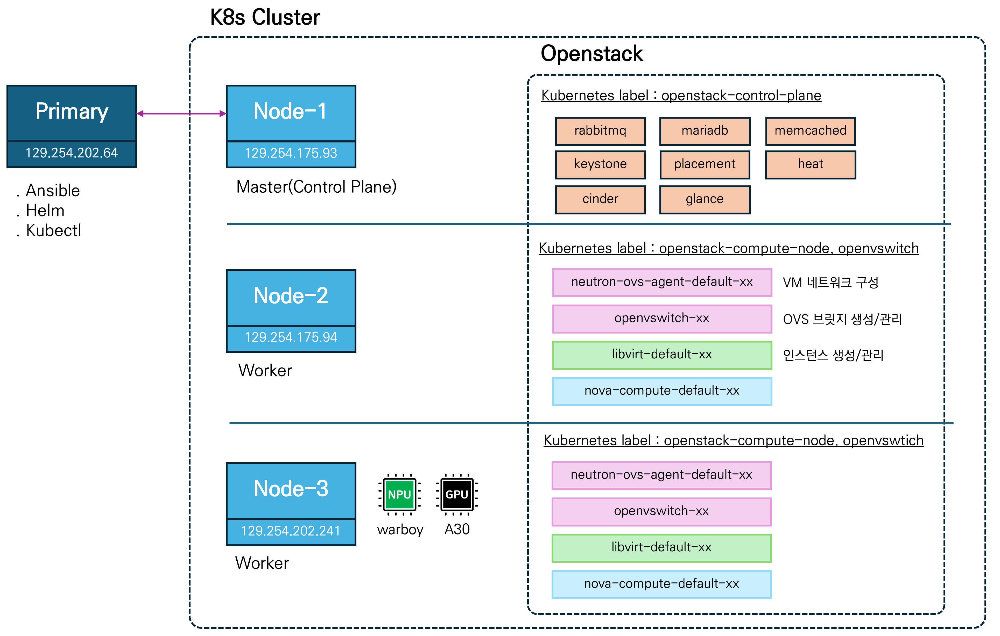  

- 설치 파일  
  - [2507_openstack-helm-install.tar.gz](assets/files/2507_openstack-helm-install.tar.gz)
  - [2507_openstack-helm-install.zip](assets/files/2507_openstack-helm-install.zip)

### 2.1. Version 요구사항  

|Openstack version|Host OS|Image OS|Kubernetes version|
|-|-|-|-|
|2024.1 (Caracal)|Ubuntu Jammy|Ubuntu Jammy|>=1.29,<=1.31|
|2024.2 (Dalmatian)|Ubuntu Jammy|Ubuntu Jammy|>=1.29,<=1.31|
|2025.1 (Epoxy)|Ubuntu Jammy|Ubuntu Jammy|>=1.29,<=1.31|
|2025.1 (Epoxy)|Ubuntu Noble|Ubuntu Noble|>=1.29,<=1.31|

📘 참조: [openstack_doc(link)](https://docs.openstack.org/openstack-helm/latest/readme.html#versions-supported)


### 2.2. Hardward 요구사항  
- Kubectl, Ansible 실행 노드
  - ansible `inventory.yaml` 작성 시, `primary` 로 지정
- Kubernetes Cluster
  - Master, Worker Node 구성
  - openstack-helm 설치 예제에서는 Master Node (1 ea), Worker Node(3 ea)으로 구성됨

### 2.3. Prerequisite step

#### Primary Node

Kubectl, Ansible 실행 노드

- python pip 설치  

```shell
apt install python3-pip
``` 

- SSH 공개키 인증 설정
  - 위 결과로 `~/.ssh/id_rsa`, `~/.ssh/id_rsa.pub` 생성됨  
  - 이후, 해당 공개키를 접근하려는 서버(`k8s_cluster`)에 복사 

```shell
ssh-keygen -t rsa -b 4096 -f ~/.ssh/id_rsa

##-- 출력 예 >
Generating public/private rsa key pair.
Enter passphrase (empty for no passphrase):                      # Enter
Enter same passphrase again:                                     # Enter
Your identification has been saved in /root/.ssh/id_rsa
Your public key has been saved in /root/.ssh/id_rsa.pub
The key fingerprint is:
SHA256:kb5GuZioxltaVdQ9Gr51ywXM+jkjsTS0cfz+7U9HigM root@kcloud-64
The key's randomart image is:
+---[RSA 4096]----+
|        .. . +   |
|       . .o = *  |
|        +. + * o |
|       o oo B . o|
|      . S E+ B =.|
|     o + o..o.Bo.|
| .  + o +   o..o=|
|  o=   .     . .+|
| .+.           .+|
+----[SHA256]-----+
```  

```shell
# primary 10.10.10.11, node-1 10.10.10.12, node-2 10.10.10.13 ...
ssh-copy-id -i ~/.ssh/id_rsa.pub kcloud@10.10.10.11
ssh-copy-id -i ~/.ssh/id_rsa.pub kcloud@10.10.10.12
ssh-copy-id -i ~/.ssh/id_rsa.pub kcloud@10.10.10.13
... 
```  


#### All Nodes

passwordless sudo 설정
- Ansible에서 root 권한 명령어(`sudo`)를 쓸 때, 비밀번호 없이 실행 가능하도록 설정  

```shell
sudo visudo  
##-- > Open 된 파일에 아래 내용 추가 (kcloud가 적용할 User명)
# Allow ubuntu user to execute any command without password
kcloud ALL=(ALL) NOPASSWD:ALL
```  


#### (필요 시) GPU/NPU Passthrough 설정 

GPU, NPU Passthorugh를 적용할 경우, 미리 vfio driver 설정 필요  
- K8s Worker Node를 타겟으로 한다.  
- Openstack nova-compute, openvswitch가 설치되는 Node를 타겟으로 한다.

📘 장치 확인 (PCI 주소, VendorID, Device ID)
```shell
lspci -nnk | grep -i nvidia
##-- > 출력 예 (NVIDIA A30)
18:00.0 3D controller [0302]: NVIDIA Corporation GA100GL [A30 PCIe] [10de:20b7] (rev a1)
        Subsystem: NVIDIA Corporation GA100GL [A30 PCIe] [10de:1532]
        Kernel modules: nvidiafb, nouveau

lspci -nnk -s 18:00.0
##-- > 출력 예 (NVIDIA A30)
18:00.0 3D controller [0302]: NVIDIA Corporation GA100GL [A30 PCIe] [10de:20b7] (rev a1)
        Subsystem: NVIDIA Corporation GA100GL [A30 PCIe] [10de:1532]
        Kernel modules: nvidiafb, nouveau

##-- > 출력 예 (Furiosa Worboy)
lspci -nnk | grep -i furiosa
af:00.0 Processing accelerators [1200]: FuriosaAI, Inc. Warboy [1ed2:0000] (rev 01)
        Subsystem: FuriosaAI, Inc. Warboy [1ed2:0000]
```  

📘 vfio 활성화를 위한 grub 설정

- `intel_iommu=on` : Intel CPU의 IOMMU (VT-d) 활성화(PCI Passthrough 지원하도록)
- `vfio-pci.ids` : 지정한 PCI 장치 ID를 부팅 시, VFIO-PCI 드라이버가 잡도록 예약
- `softdep nvidia pre: vfio-pci` : nvidia 모듈이 로드되기 전 vfio-pci가 먼저 로드되도록 보장
- `blacklist nouveau` : nouveau 및 nvidiafb 드라이버를 커널 블랙리스트에 추가해 GPU를 이들이 점유하지 못하게 하고, VFIO가 장치를 전용으로 사용할 수 있게 함
- `etc/modules-load.d/modules.conf` : 파일에 명시된 모듈들이 부팅 시 자동으로 로드되도록 설정  


```shell
sudo vim /etc/default/grub
##-- > 아래 내용으로 수정
GRUB_CMDLINE_LINUX_DEFAULT="quiet splash intel_iommu=on vfio-pci.ids=10de:20b7,1ed2:0000"

cat <<EOF | sudo tee /etc/modprobe.d/vfio.conf
softdep nvidia pre: vfio-pci
options vfio-pci ids=10de:20b7,1ed2:0000
EOF

cat <<EOF | sudo tee /etc/modprobe.d/blacklist-nvidia.conf
blacklist nouveau
blacklist nvidiafb
EOF

cat << EOF | sudo tee -a /etc/modules-load.d/modules.conf
vfio
vfio_iommu_type1
vfio_pci
EOF
```  

📘 변경사항 적용 및 확인  
- 해당 장치의 `Kernel driver in use: vfio-pci`를 확인

```shell
# 드라이버/블랙리스트 변경 시, 초기 RAM 디스크 이미지 생성/갱신 (initramfs)
sudo update-initramfs -u
# 커널 파라미터 변경 시, GRUB 설정 파일(grub.cfg) 재생성
sudo update-grub
sudo reboot

lspci -nnk -s 18:00
##-- > 출력 예 (NVIDIA A30)
(base) root@kcloud-241:~# lspci -nnk -s 18:00
18:00.0 3D controller [0302]: NVIDIA Corporation GA100GL [A30 PCIe] [10de:20b7] (rev a1)
        Subsystem: NVIDIA Corporation GA100GL [A30 PCIe] [10de:1532]
        Kernel driver in use: vfio-pci
        Kernel modules: nvidiafb, nouveau

```  

#### (필요 시) Network 장치명 변경 

설치 노드 Network Interface Name 통일  
- Neutron 설치 시, Interface Name 설정 관련  
  - 📕현재 모든 노드 같은 이름으로 통일하도록 구성함  
  

```shell
##-- mac address 확인
ip link show

##-- ex) 1c:69:7a:0a:6d:ee 값 추출
root@kcloud-93:~# ip link show
...
2: eno1: <BROADCAST,MULTICAST,UP,LOWER_UP> mtu 1500 qdisc fq_codel state UP mode DEFAULT group default qlen 1000
    link/ether 1c:69:7a:0a:6d:ee brd ff:ff:ff:ff:ff:ff
    altname enp0s31f6

##-- /etc/netplan/00-installer-config.yaml 에 지정
vim  /etc/netplan/00-installer-config.yaml
##-- > match, macaddress, set-name 추가
network:
  ethernets:
    eno1:
      addresses:
      - 129.254.175.93/24
      gateway4: 129.254.175.1
      nameservers:
        addresses:
        - 129.254.16.61
        search:
        - 8.8.8.8
      match:
        macaddress: 1c:69:7a:0a:6d:ee
      set-name: enp4s0
  version: 2

##-- 네트워크 재시작
netplan apply
```

### 2.4. Helm 설치
Script 활용 설치  

```shell
mkdir helm
cd helm

curl -fsSL -o get_helm.sh https://raw.githubusercontent.com/helm/helm/main/scripts/get-helm-3
chmod 700 get_helm.sh
./get_helm.sh
```  
  

---  
📙 아래 과정은(2.5~ 이후) **Primary** 노드에서 진행  

---  


### 2.5. Helm chart repo. 및 plugin 설치

```shell
helm repo add openstack-helm https://tarballs.opendev.org/openstack/openstack-helm
```  
- `helm repo add`: Helm의 chart 저장소 등록 명령어
- openstack-helm 과 관련된 chart들을 모아둔 링크를 `openstack-helm` 으로 명명


```shell
helm plugin install https://opendev.org/openstack/openstack-helm-plugin
```  
- `helm plugin install`: Helm에 플러그인을 설치하는 명령어
- openstack-helm 설치를 편하게 도와주는 명령어들의 집합  


### 2.6. Kubernetes 설치

> https://opendev.org/openstack/openstack-helm/src/branch/master/roles/deploy-env

- Helm 및 필요한 도구 설치
- Containerd 설치 (K8s Container Runtime으로 활용)
- K8s 설치 (Kubeadm 사용, Master Node 1개)
- Calico CNI 설치
- Primary Node(배포 노드, Helm, Kubectl 같은 CLI 도구 설치하는 곳)와 K8s Control Plane Node(K8s Master Node) 통신용 Tunnel 설정  


#### Clone roles git repositories

Openstack-helm이 Kubernetes를 설치할 때, 필요한 역할(role)들을 별도의 Git 저장소로 활용  

```shell
mkdir ~/osh
cd ~/osh
git clone https://opendev.org/openstack/openstack-helm.git
git clone https://opendev.org/zuul/zuul-jobs.git
```  

#### Install Ansible

```shell
pip install ansible

sudo apt update
sudo apt install software-properties-common
sudo add-apt-repository --yes --update ppa:ansible/ansible
sudo apt install ansible
```  

#### Set roles lookup path
앞서, Clone roles git repo.. 과정으로 clone한 디렉토리를  
Ansible에서 역할(role)로 인식하여 작업을 수행하도록 경로를 설정해주는 작업  

```shell
export ANSIBLE_ROLES_PATH=~/osh/openstack-helm/roles:~/osh/zuul-jobs/roles
```  

- 터미널을 열 때마다 `export` 하기 싫을 경우  

```shell  
cd ~/osh
vim ansible.cfg  

##-- ex) ansible.cfg >
[defaults]
roles_path = ~/osh/openstack-helm/roles:~/osh/zuul-jobs/roles
```  

#### Prepare inventory
구성하려는 환경에 따라 아래 내용을 수정해야 함
- ansible_port
- ansible_user
- ansible_ssh_private_key_file
- user, group
- ansible_host

설정변수
- vars: 기본 변수
- children: 서버 그룹 정의  

📙 해당 설정은 Test 용으로 간주한다.  
- Loopback Device를 만들어서 Ceph와 같은 스토리지 시스템에 사용  
- metalLB를 사용하여 LoadBalancer 기능이 없는 로컬 테스트 클러스터에 외부 IP 할당  
- TLS 인증, RBAC 설정, 인증서 관리 등 보안 요소가 없거나 간단하게 처리  

📙 현재 primary와 kubernetes master node는 서로 다른 노드로 구성  
- 추후, primary와 kubernetes master node를 동일화 하는 과정 확인 필요  
  - 현재는 두 node가 같을 경우 설치 중 오류 발생  


```shell
cat > ~/osh/inventory.yaml <<EOF
---
all:
  vars:
    ansible_user: kcloud
    ansible_port: 22
    ansible_ssh_private_key_file: /home/kcloud/.ssh/id_rsa
    ansible_ssh_extra_args: -o StrictHostKeyChecking=no
    kubectl:
      user: kcloud
      group: kcloud
    docker_users:
      - kcloud
    client_ssh_user: kcloud
    cluster_ssh_user: kcloud
    metallb_setup: true
    loopback_setup: true
    loopback_device: /dev/loop100
    loopback_image: /var/lib/openstack-helm/ceph-loop.img
    loopback_image_size: 12G
  hosts:
    primary:
      ansible_host: 129.254.202.64
    node-1:
      ansible_host: 129.254.175.93
    node-2:
      ansible_host: 129.254.175.94
    node-3:
      ansible_host: 129.254.202.241
    node-4:
      ansible_host: 129.254.202.242
  children:
    primary:
      hosts:
        primary:
    k8s_cluster:
      hosts:
        node-1:
        node-2:
        node-3:
        node-4:
    k8s_control_plane:
      hosts:
        node-1:
    k8s_nodes:
      hosts:
        node-2:
        node-3:
        node-4:
EOF
```  

#### Prepare playbook
모든 서버(all)에 대해 다음 역할을 순서대로 실행  
- `ensure-python`: Python이 설치되어 있지 않은 서버에 설치  
- `ensure-pip`: pip 설치  
- `clear-firewall`: 방화벽 초기화 (포트 열림 확인)  
- `deploy-env`: Helm, Containerd, Kubernetes, Calico, DNS 설정 등 클러스터 전반 설치    


```shell
cat > ~/osh/deploy-env.yaml <<EOF
---
- hosts: all
  become: true
  gather_facts: true
  roles:
    - ensure-python
    - ensure-pip
    - clear-firewall
    - deploy-env
EOF
```  

#### SSh 공개기 변수 오류 방지를 위해 아래 내용을 수정

📕 ansible 실행 시, 작업이 모든 노드에서 병렬로 실행  
- openstack-helm의 deploy-env 작업이 병렬로 실행되는데, SSH 공개키의 값을 순차적으로 받아오는 코드 존재  
- 따라서, 경우에 따라 SSH 공개키 값이 None으로 처리되어 설치 오류 발생함  
- 공개키에 대한 변수(hostvars)의 값인 `ssh_public_key`를 primary 노드에서 실행 시, 마다 가져오도록 변경

```shell
vim ~osh/openstack-helm/roles/deploy-env/tasks/client_cluster_tunnel.yaml
```  

```yaml
# 아래 Register public wireguard key variable 추가 

- name: Setup wireguard keys
  when: (groups['primary'] | difference(groups['k8s_control_plane']) | length > 0)
  block:
    - name: Generate wireguard key pair
      shell: |
        wg genkey | tee /root/wg-private-key | wg pubkey > /root/wg-public-key
        chmod 600 /root/wg-private-key
      when: (inventory_hostname in (groups['primary'] | default([]))) or (inventory_hostname in (groups['k8s_control_plane'] | default([])))


    - name: Register public wireguard key variable
      command: cat /root/wg-public-key
      register: wg_public_key
      when: (inventory_hostname in (groups['primary'] | default([]))) or (inventory_hostname in (groups['k8s_control_plane'] | default([])))
```

```shell
vim ~osh/openstack-helm/roles/deploy-env/tasks/client_cluster_ssh.yaml 
```  

```yaml
# 아래 Save ssh public key to hostvars 추가
# 아래 Set primary ssh public key 수정
    - name: Read ssh public key
      command: cat "{{ client_user_home_directory }}/.ssh/id_ed25519.pub"
      register: ssh_public_key
      when: (inventory_hostname in (groups['primary'] | default([])))

    - name: Save ssh public key to hostvars
      set_fact:
        ssh_public_key: "{{ ssh_public_key }}"
      delegate_to: localhost
      run_once: true
      when: (inventory_hostname in (groups['primary'] | default([])))
      
- name: Setup passwordless ssh from primary and cluster nodes
  become_user: "{{ cluster_ssh_user }}"
  block:
    #- name: Set primary ssh public key
    #  set_fact:
    #    client_ssh_public_key: "{{ (groups['primary'] | map('extract', hostvars, ['ssh_public_key', 'stdout']))[0] }}"
    #  when: inventory_hostname in (groups['k8s_cluster'] | default([]))
    - name: Set primary ssh public key
      set_fact:
        client_ssh_public_key: "{{ hostvars[groups['primary'][0]].ssh_public_key.stdout | default('') }}"
      when: inventory_hostname in (groups['k8s_cluster'] | default([]))
```  

#### Run the playbook
 
```shell
cd ~/osh
ansible-playbook -i inventory.yaml deploy-env.yaml
```

```shell
##-- 실행 결과 예 >
kcloud@kcloud-64:~/osh$ kubectl get node -o wide
NAME        STATUS   ROLES           AGE     VERSION   INTERNAL-IP      EXTERNAL-IP   OS-IMAGE             KERNEL-VERSION      CONTAINER-RUNTIME
kcloud-93   Ready    control-plane   4h27m   v1.32.5   129.254.175.93   <none>        Ubuntu 22.04.1 LTS   5.15.0-43-generic   containerd://1.7.27
kcloud-94   Ready    <none>          4h26m   v1.32.5   129.254.175.94   <none>        Ubuntu 22.04.1 LTS   5.15.0-43-generic   containerd://1.7.27

kcloud@kcloud-64:~/osh$ kubectl get pod -A
NAMESPACE     NAME                                        READY   STATUS    RESTARTS       AGE
kube-system   calico-kube-controllers-7c5bbf5ff4-sbxt4    1/1     Running   0              3h31m
kube-system   calico-node-76bd8                           0/1     Running   0              3h31m
kube-system   calico-node-9c4lj                           0/1     Running   0              3h31m
kube-system   coredns-668d6bf9bc-2xfgm                    1/1     Running   1 (169m ago)   4h26m
kube-system   coredns-668d6bf9bc-qlcl5                    1/1     Running   0              4h26m
kube-system   etcd-kcloud-93                              1/1     Running   0              4h27m
kube-system   kube-apiserver-kcloud-93                    1/1     Running   0              4h27m
kube-system   kube-controller-manager-kcloud-93           1/1     Running   0              4h27m
kube-system   kube-proxy-dptgb                            1/1     Running   0              4h26m
kube-system   kube-proxy-glzb6                            1/1     Running   0              4h26m
kube-system   kube-scheduler-kcloud-93                    1/1     Running   0              4h27m
openstack     ingress-nginx-controller-596c6f6858-pnw54   1/1     Running   0              2m58s
```  


### 2.7. Kubernetes preqeuisites  

📕 Ingress Controller와 MetalLB는 Openstack API Endpoint용  
- Kubernetes로 관리되는 Openstack Component (nova, neutron, cinder .. 등) 접근  

📕 Openstack으로 생성된 가상머신에 대한 접근은 `Neutron 라우터 + floating IP 할당` 으로 수행  
- floating IP = external network  
  - 이 외부 네트워크는 실제 노드(서버)의 물리 브릿지 `br-ex`에 연결됨  
  - 이 물리 브릿지는 물리적 L2 네트워크(스위치)에 연결되어야 함  
  - 서버에서 VM에 접근하기 위해서는 flaoting IP 대역을 서버와 같은 네트워크 대역으로 설정해야 한다.  
  
#### Ingress controller  
Kubernetes에서 배포되는 OpenStack 서비스의 대한 외부 접근 허용 목적 

- 📕openstack-helm 설치를 위해 필수 요소인지 확인 필요함
- `ingress-nginx` 활용(추천)
- reverse proxy backend는 `nginx`  

##### 네임스페이스 생성
OpenStack 워크로드에 대한 네임스페이스를 생성  
Ingress controller는 동일한 네임스페이스에 배포해야 함  
- openstack-helm chart가 서비스 리소스 생성 시, Ingress controller Pod를 대상으로 설정하기 때문   


```shell
tee > /tmp/openstack_namespace.yaml <<EOF
apiVersion: v1
kind: Namespace
metadata:
  name: openstack
EOF

kubectl apply -f /tmp/openstack_namespace.yaml
```

##### Deploy ingress controller in the openstack namespace
- Ingress controller Pod에 `app: ingress-api` 라벨 설정 필수  
  - 이는 openstack-helm이 kubernetes 서비스 리소스 생성 시, Ingress controller Pod를 선택하는데 사용  
  - ex) openstack-helm의 keystone 차트는 기본적으로 `app: ingress-api` 라벨을 사용하여 ingress controller pods로 트래픽을 리다이렉트하는 서비스를 생성함  
  - ex) 이 때, Ingress 리소스도 함께 생성되며 이는 Ingress Controller가 내부적으로 사용하는 리버스 프록시(nginx) 설정에 활용  
  - ex) 결과적으로 nginx는 트래픽을 keystone API 서비스로 라우팅하며, 이 서비스는 실제 Keystone API Pod의 EndPoint 역할을 수행  

> Ingress Controller는 클러스터로 들어오는 HTTP/HTTPS 요청을 K8s Service로 라우팅    

> Openstack-helm은 어떤 Ingress Controller를 써도 상관없지만, 반드시, 해당 컨트롤러의 Pod에 **app: ingress-api** 라벨을 붙여야 함

> 외부에서 Openstack API에 접근할 수 있도록 하려면, Ingress Controller 앞단에 외부 접근이 가능한 Kubernetes 리소스(LoadBalancer 또는 NodePort)를 만들어야 하며, 이는 ingress controller pods를 선택하도록 해야 함  

📗 Client ➡️  Ingress ➡️ Nginx(Ingress Controller) ➡️ Keystone Service ➡️ Keystone Pod  
- 이 때 클라이언트는 Horizon, 다른 Openstack 컴포넌트들, 사용자 애플리케이션, Openstack-Client 등

📙 MetalLB, LoadBalancer 이용 K8s 클러스터 외부에서 접근하려 할 경우  
- `--set controller.service.enabled="true"` 로 변경

```shell
##-- ingress-nginx 의 helm chart Repo 추가
helm repo add ingress-nginx https://kubernetes.github.io/ingress-nginx

##-- 위에서 생성한 openstack 네임스페이스에 설치
##-- 외부망을 사용하지 않을 경우 --set controller.service.enabled="false" \ 이와 같이 변경
helm upgrade --install ingress-nginx ingress-nginx/ingress-nginx \
    --version="4.8.3" \
    --namespace=openstack \
    --set controller.kind=Deployment \
    --set controller.admissionWebhooks.enabled="false" \
    --set controller.scope.enabled="true" \
    --set controller.service.enabled="true" \
    --set controller.ingressClassResource.name=nginx \
    --set controller.ingressClassResource.controllerValue="k8s.io/ingress-nginx" \
    --set controller.ingressClassResource.default="false" \
    --set controller.ingressClass=nginx \
    --set controller.labels.app=ingress-api
```  

📗 참고  

| 설정 항목 | 설명 |  
|-----------|------|  
| `--version="4.8.3"` | Helm chart의 특정 버전 사용 (안정성과 호환성 확보 목적) |  
| `--namespace=openstack` | `openstack` 네임스페이스에 리소스 설치 |  
| `controller.kind=Deployment` | Ingress Controller를 Deployment로 실행 (대안: DaemonSet) |  
| `controller.admissionWebhooks.enabled="false"` | Webhook Admission Controller 비활성화 (간소화 목적) |  
| `controller.scope.enabled="true"` | NGINX Controller의 리소스 검색 범위를 네임스페이스로 제한 |  
| `controller.service.enabled="false"` | LoadBalancer/NodePort 서비스 생성 방지 (사용자가 별도 구성 예정) |  
| `controller.ingressClassResource.name=nginx` | IngressClass 이름을 `nginx`로 지정 |  
| `controller.ingressClassResource.controllerValue="k8s.io/ingress-nginx"` | Ingress Controller가 처리할 클래스 식별자 |  
| `controller.ingressClassResource.default="false"` | 기본 IngressClass로 지정하지 않음 |  
| `controller.ingressClass=nginx` | Ingress 리소스에서 사용할 ingressClass 이름 |  
| `controller.labels.app=ingress-api` | Pod에 `app=ingress-api` 라벨 부여 → OpenStack-Helm이 서비스 대상으로 인식하는 필수 라벨 |  


```shell
##-- 수행 결과 >
kcloud@kcloud-64:~/osh$ kubectl get ns -A
NAME              STATUS   AGE
default           Active   4h26m
kube-node-lease   Active   4h26m
kube-public       Active   4h26m
kube-system       Active   4h26m
openstack         Active   2m37s

kcloud@kcloud-64:~/osh$ kubectl get pod -A
NAMESPACE     NAME                                        READY   STATUS    RESTARTS       AGE
kube-system   calico-kube-controllers-7c5bbf5ff4-sbxt4    1/1     Running   0              3h30m
kube-system   calico-node-76bd8                           0/1     Running   0              3h30m
kube-system   calico-node-9c4lj                           0/1     Running   0              3h30m
kube-system   coredns-668d6bf9bc-2xfgm                    1/1     Running   1 (168m ago)   4h26m
kube-system   coredns-668d6bf9bc-qlcl5                    1/1     Running   0              4h26m
kube-system   etcd-kcloud-93                              1/1     Running   0              4h26m
kube-system   kube-apiserver-kcloud-93                    1/1     Running   0              4h26m
kube-system   kube-controller-manager-kcloud-93           1/1     Running   0              4h26m
kube-system   kube-proxy-dptgb                            1/1     Running   0              4h26m
kube-system   kube-proxy-glzb6                            1/1     Running   0              4h26m
kube-system   kube-scheduler-kcloud-93                    1/1     Running   0              4h26m
openstack     ingress-nginx-controller-596c6f6858-pnw54   1/1     Running   0              2m12s
```

#### metalLB

L2/L3 프로토콜을 활용하여 베어메탈 Kubernetes 클러스터에서 사용하는 LoadBalancer  
  - ex) 외부에 Kubernetes에서 실행되는 웹 애플리케이션 노출  

📗 설치

```shell
tee > /tmp/metallb_system_namespace.yaml <<EOF
apiVersion: v1
kind: Namespace
metadata:
  name: metallb-system
EOF

kubectl apply -f /tmp/metallb_system_namespace.yaml

helm repo add metallb https://metallb.github.io/metallb
helm install metallb metallb/metallb -n metallb-system

##-- 결과 확인 >
kcloud@kcloud-64:~$ kubectl get ns metallb-system
NAME             STATUS   AGE
metallb-system   Active   106m

kcloud@kcloud-64:~$ kubectl get svc -n metallb-system
NAME                      TYPE        CLUSTER-IP     EXTERNAL-IP   PORT(S)   AGE
metallb-webhook-service   ClusterIP   10.96.125.26   <none>        443/TCP   84m

kcloud@kcloud-64:~$ kubectl get endpoints -n metallb-system
NAME                      ENDPOINTS           AGE
metallb-webhook-service   10.244.103.8:9443   84m

kcloud@kcloud-64:~$ kubectl get pods -n metallb-system
NAME                                  READY   STATUS    RESTARTS   AGE
metallb-controller-5754956df6-j4tcr   1/1     Running   0          84m
metallb-speaker-h9ghp                 4/4     Running   0          84m
metallb-speaker-pdwmq                 4/4     Running   0          84m
```  


📗 IP 주소 풀, L2 광고(Broadcast/ARP) 설정

```shell
tee > /tmp/metallb_ipaddresspool.yaml <<EOF
---
apiVersion: metallb.io/v1beta1
kind: IPAddressPool
metadata:
    name: public
    namespace: metallb-system
spec:
    addresses:
    - "172.24.128.0/24"
EOF

### 단일 IP 지정
tee > /tmp/metallb_ipaddresspool.yaml <<EOF
---
apiVersion: metallb.io/v1beta1
kind: IPAddressPool
metadata:
  name: public
  namespace: metallb-system
spec:
  addresses:
    - "129.254.202.253-129.254.202.253"
EOF


kubectl apply -f /tmp/metallb_ipaddresspool.yaml


tee > /tmp/metallb_l2advertisement.yaml <<EOF
---
apiVersion: metallb.io/v1beta1
kind: L2Advertisement
metadata:
    name: public
    namespace: metallb-system
spec:
    ipAddressPools:
    - public
EOF

kubectl apply -f /tmp/metallb_l2advertisement.yaml


##-- 결과 확인 >
kcloud@kcloud-64:~$ kubectl get ipaddresspool -n metallb-system
NAME     AUTO ASSIGN   AVOID BUGGY IPS   ADDRESSES
public   true          false             ["172.24.128.0/24"]

kcloud@kcloud-64:~$ kubectl get l2advertisement -n metallb-system
NAME     IPADDRESSPOOLS   IPADDRESSPOOL SELECTORS   INTERFACES
public   ["public"]
```

📗 앞으로 배포할 Openstack 서비스의 공개 Endpoint 역할을 하는 LoadBalancer 타입의 서비스 생성  
- 이 서비스는 트래픽을 Ingress 컨트롤러 Pod로 전달함  
- Ingress 오브젝트는 `openstack.svc.cluster.local` DNS 규칙을 포함  
  - 외부에서 접근을 위해서, Ingress 수정 필요  
  - 이는 `host_fqdn_override`를 사용하여 대체 호스트 이름 설정으로 수행  
  - 172.24.128.100 IP로 노출된다면, `<service>.172-24-128-100.sslip.io` 같은 형식 사용 가능  
  - ex) Keystone 차트에서 `host_fqdn_override` 설정 예
    ```yaml
    endpoints:
      identity:
        host_fqdn_override:
          public:
            host: "keystone.172-24-128-100.sslip.io"
    ```  


```shell

##-- default
tee > /tmp/openstack_endpoint_service.yaml <<EOF
---
kind: Service
apiVersion: v1
metadata:
  name: public-openstack
  namespace: openstack
  annotations:
    metallb.universe.tf/loadBalancerIPs: "129.254.202.253"
spec:
  externalTrafficPolicy: Cluster
  type: LoadBalancer
  selector:
    app: ingress-api
  ports:
    - name: http
      port: 80
    - name: https
      port: 443
EOF

##-- 외부망 연동
tee > /tmp/openstack_endpoint_service.yaml <<EOF
---
kind: Service
apiVersion: v1
metadata:
  name: public-openstack
  namespace: openstack
  annotations:
    metallb.universe.tf/loadBalancerIPs: "172.24.128.100"
spec:
  externalTrafficPolicy: Cluster
  type: LoadBalancer
  selector:
    app: ingress-api
  ports:
    - name: http
      port: 80
    - name: https
      port: 443
EOF  


kubectl apply -f /tmp/openstack_endpoint_service.yaml

##-- 결과 확인 >
kcloud@kcloud-64:~$ kubectl get svc -n openstack
NAME               TYPE           CLUSTER-IP     EXTERNAL-IP      PORT(S)                      AGE
public-openstack   LoadBalancer   10.96.253.72   129.254.202.253  80:31785/TCP,443:30640/TCP   11s
```  


📗 참조 (트래픽 흐름)

- 구성  
    - MetalLB 풀: 129.254.202.0/24
    - 고정 IP(외부 노출): 129.254.202.253
    - K8s Service: 이름 (public-openstack), 타입(LoadBalancer)
        - K8s Selector: app: ingress-api
        - K8s Pod: Ingress Controller Pods
<br>
- 외부 접속  
    - 사용자 ([http](https://keystone.129-254-202-253.sslip.io/v3/))  
        - DNS 해석: 129.254.202.253
<br>
- MetaLb  
    - 사용자 패킷이 클러스터 노드의 NIC을 통해 수신되면  
    - MetalLB는 해당 IP가 자신이 광고(L2Advertisement)한 것임을 파악  
    - LoadBalancer 서비스 (public-openstack)으로 패킷 전달  
<br>
- Kuberentes Service  
    - 클러스터 내부의 Ingress Controller Pods 가리킴  
    - selector: app: ingress-api 로 Ingress Controller Pod 목록 선택  
<br>
- Ingress Controller
    - ex) nginx-ingress-controller
    - 수신한 HTTP/HTTPS 요청을 확인
    - Reverse Proxy 역할
    - Ingress 리소스 규칙을 읽음
        - ex) keystone.129-254-202-253.sslip.io = Keystone 서비스
<br>
- 내부 Openstack Service로 라우팅
    - ex) Keystone ➡️ openstack/keystone-api Service ➡️ Keystone Pod
<br>

- 전체 흐름  
    - 사용자 브라우저 
    - ➡️ https://keystone.29-254-202-253.sslip.io (해당 도메인은 172.24.128.100으로 해석)
    - ➡️ [MetalLB 광고된 IP: 129.254.202.253]
    - ➡️ Kubernetes Service (public-openstack, LoadBalancer)
    - ➡️ Ingress Controller Pods (app: ingress-api)
    - ➡️ Ingress Resource 규칙 (keystone.172-24-128-100.sslip.io → keystone 서비스)
    - ➡️ Keystone Pod  

#### Node labels

> 📕 ceph 배포 시, 최소 2개 node이상 work node가 필요하므로, work node가 하나인 test 환경에서는
> 마스터 노드에 pod를 배포하기 위해 node labels 작업이 우선되어야 한다. 

라벨은 openStack-Helm 차트가 특정 서비스 또는 네트워크 드라이버를 배포할 때 대상 노드를 결정하는 데 사용  

`--all`은 클러스터 내 모든 노드에 라벨을 설정  

- 특정 노드만 지정하려면, `--all` 대신 노드 이름으로 실행  

`--overwrite` 옵션은 기존 동일 키의 라벨이 있을 경우 덮어쓰기  

기본적으로 control plane 노드는 `node-role.kubernetes.io/control-plane:NoSchedule` 옵션으로 Pod가 스케줄링 되지 않음  
- 이를 해당 taint를 삭제함으로써 해당 노드에서도 Pod가 스케줄될 수 있도록 허용  
- 일반적인 운영환경에서는 권장하지 않음 (테스트용도로만 활용)    


openstack-control-plane : Openstack API 서버 및 상태 정보, 인증/권한관리 등 중앙제어  

- Keystone (인증)
- Horizon (대시보드)
- MariaDB (DB)
- RabbitMQ (메시지 브로커)
- Glance (이미지서비스)
- Heat, Barbican 등

openstack-compute-node : 실제 VM이 생성되고, 실행되는 Compute 리소스 제공 노드, Libvirt가 Hypervisor(QEMU/KVM) 연동하여 VM 구동  
- Nova  
- Libvirt  
- Ceilometer agent, collectd

openvswitch : OpenStack Neutron에서 사용하는 가상 스위치 드라이버 중 Open vSwitch 관련 컴포넌트 배포 (보통 Worker Node에 배포)  
- neutron-openvswitch-agent (DaemonSet)  
- ovs-vswichd, ovsdb-server 등

Openstack 컴포넌트 설치를 위해, 아래 label 작업 필요   
- `-all`은 전체 노드

```shell
# Openstack 컨트롤 플레인 컴포넌트(Pod) 해당 노드에서 실행
# - ex) keystone, horizon, rabbitmq, mariadb
kubectl label --overwrite nodes --all openstack-control-plane=enabled

# Openstack Compute 노드(Nod, compute, libvirt 등) 컴포넌트들이 해당 노드에서 실행
# - ex) 일반적으로 VM을 생성할 수 있는 Worker Node 의미
kubectl label --overwrite nodes --all openstack-compute-node=enabled
#kubectl label --overwrite nodes kcloud-241 kcloud-242 openstack-compute-node=enabled

# Openstack Neutron 네트워크 백엔드 중 하나인 Open vSwitch가 배포될 수 있는 노드
# - ex) OVS DaemonSet 등
# K8s Node 중 Openstack Cluster를 구성할 하나의 Worker Node에만 적용
kubectl label --overwrite nodes --all openvswitch=enabled
#kubectl label --overwrite nodes kcloud-241 kcloud-242 openvswitch=enabled

# Openstack Neutron 에서 Linux Bridge 네트워크 드라이버를 사용 시 적용
# Open vSwtich와는 별도의 백엔드 드라이버
# 둘 중 하나만 사용할 수 있음
# kubectl label --overwrite nodes --all linuxbridge=enabled
```  

Openstack Neutron은 가상머신(VM)에 네트워크를 연결하는 역할을 수행함  
- 단, 실제로 패킷을 처리하고 브리징하거나 라우팅하는 작업은 Neutron이 직접 하지 않고, 백엔드 드라이버(Plugin/Agent)가 처리함
- 대표적인 백엔드 드라이버는
    - open vSwitch
    - Linux Bridge

| 드라이버           | 설명                          | 네트워크 처리 방식                        |
|--------------------|-------------------------------|-------------------------------------------|
| **Open vSwitch (OVS)** | 성능 중심의 가상 스위치        | 커널 모듈 + 유저스페이스                 |
| **Linux Bridge**       | 기본적인 가상 브리지            | 전통적인 Linux bridge + iptables 기반    |

- 백엔드 드라이버 비교

| 항목           | Open vSwitch (OVS)               | Linux Bridge                       |
|----------------|----------------------------------|------------------------------------|
| **성능**        | 일반적으로 더 나음                | 다소 느림                           |
| **구성 복잡도** | 약간 복잡함                       | 간단함                              |
| **기능**        | VXLAN, GRE, QoS 등 다양           | 기능 제한적                         |
| **사용 예시**   | 대규모 클라우드, 고성능 요구       | 소규모 테스트, 단순 구성            |

| 라벨 키                          | 용도                                                         |
|----------------------------------|--------------------------------------------------------------|
| `openstack-control-plane=enabled` | OpenStack의 API/컨트롤 컴포넌트 (예: keystone, heat 등) 실행 대상 |
| `openstack-compute-node=enabled` | Nova compute 서비스가 실행될 워커 노드 지정                  |
| `openvswitch=enabled`            | Open vSwitch 네트워크 드라이버를 사용할 노드 지정           |
| `linuxbridge=enabled`            | Linux Bridge 드라이버를 사용할 노드 지정                    |

```shell
##-- 설정 예 >
kcloud@kcloud-64:~/osh$ kubectl get node --show-labels
NAME        STATUS   ROLES           AGE   VERSION   LABELS
kcloud-93   Ready    control-plane   42m   v1.32.5   beta.kubernetes.io/arch=amd64,beta.kubernetes.io/os=linux,kubernetes.io/arch=amd64,kubernetes.io/hostname=kcloud-93,kubernetes.io/os=linux,node-role.kubernetes.io/control-plane=,node.kubernetes.io/exclude-from-external-load-balancers=,openstack-control-plane=enabled
kcloud-94   Ready    <none>          42m   v1.32.5   beta.kubernetes.io/arch=amd64,beta.kubernetes.io/os=linux,kubernetes.io/arch=amd64,kubernetes.io/hostname=kcloud-94,kubernetes.io/os=linux,openstack-compute-node=enabled,openstack-control-plane=enabled,openvswitch=enabled

```  


#### Ceph  
> ceph 클러스터가 `ceph` 네임스페이스에 배포되었다고 가정하여 아래 과정 진행  
> 스크립트 예제는 아래 링크(Rook Helm 차트를 사용하여 Rook Operator와 Cpeh 클러스터를 배포하는 방법)
> https://opendev.org/openstack/openstack-helm/src/branch/master/tools/deployment/ceph/ceph-rook.sh

Ceph 관리로 Rook Operator 사용  
앞서 helm 으로 생성한 loop device 사용  

`ceph-adapter-rook` 이름의 helm release 설치 혹은 업그레이드
`openstack-helm/ceph-adapter-rook`은 openstack-helm에서 제공하는 Rook-ceph 용 어댑터 차트  

`osh`는 openstack-helm 개발 환경에서 사용하는 helm wrapper또는 helper 스크립트, 명령어
`wait-for-pods`는 Helm 릴리스 설치 후, 해당 네임스페이스(openstack)에서 실행 중인 모든 Pod가 Running 또는 Completed 상태가 될 때까지 대기하는 명령  

일반적으로 ceph는 OSD 데이터를 3중 복제(replica:3)하므로, 최소 3개의 노드가 권장됨 

- 따라서 k8s master 1개 노드, k8s worker 3개 노드가 필요  


📗 kubernetes 클러스터 상에 Rook-ceph 스토리지 오케스트레이션 및 Ceph 클러스터 배포 자동화 스크립트  

- ~/osh/openstack-helm/tools/deployment/ceph/ceph-rook.sh
    - Rook-ceph 설치 준비
        - /dev/loop100 장치 활용
        - /tmp/ceph-fs-uuid.txt 를 생성하여 UUID를 파일시스템 ID로 설정
    - Rook Operator 설치
        - rook.yaml 을 통해 helm 차트를 설치
        - helm install 로 roo-ceph 네임스페이스에 설치
        - CSI 드라이버, loop device 사용 허용, 로그 레벨 설정
    - Ceph 클러스터 배포
        - ceph.yml 에 ceph 클러스터 상세 스펙 정의
        - OSD 디바이스, MOM/MGR 개수, storage class 등
        - Block Pool, CephFS, Object Gateway 등 StorageClass 정의 포함
    - 배포 검증 및 상태 확인
        - toolbox pod를 통한 ceph -s, ceph osd pool ls 명령 실행  

- <u>**아래 스크립트에는 최소 3개의 Worker Node가 필요**</u>
    - 3개의 Worker 노드를 확보하지 못했다면, `allowMultiplePerNode: true`, `count: 1`로 변경
      - 하나의 노드에 여러 개의 mon, mgr을 생성하도록 함
  
      ```shell
      mon:
        count: 1
        allowMultiplePerNode: true
      mgr:
        count: 1
        allowMultiplePerNode: true
      ```  
  
```shell
vim ~/osh/openstack-helm/tools/deployment/ceph/ceph-rook.sh
##-- Worker Node의 확보 수에 따라 아래 부분을 변경

cephClusterSpec:
  cephVersion:
    image: quay.io/ceph/ceph:v19.2.2
    allowUnsupported: false
  dataDirHostPath: /var/lib/rook
  skipUpgradeChecks: false
  continueUpgradeAfterChecksEvenIfNotHealthy: false
  waitTimeoutForHealthyOSDInMinutes: 10
  ## -- 아래 mon, mgr 부분 수정
  mon:    
    count: 3                        
    allowMultiplePerNode: false
  mgr:
    count: 3
    allowMultiplePerNode: false
    modules:
      - name: pg_autoscaler
        enabled: true
      - name: dashboard
        enabled: false
      - name: nfs
        enabled: false
```  

```shell
cd ~osh/
./openstack-helm/tools/deployment/ceph/ceph-rook.sh

helm upgrade --install ceph-adapter-rook openstack-helm/ceph-adapter-rook \
    --namespace=openstack

helm osh wait-for-pods openstack
```

```shell
##-- 실행 완료 예 >
kcloud@kcloud-64:~$ kubectl get pod -A
NAMESPACE        NAME                                        READY   STATUS      RESTARTS        AGE
ceph             rook-ceph-mds-cephfs-a-685f54d5cb-pznzv     2/2     Running     0               2d15h
ceph             rook-ceph-mds-cephfs-b-7d6f69d74-zxfw2      2/2     Running     0               2d15h
ceph             rook-ceph-mgr-a-866b885499-mhmln            2/2     Running     0               2d15h
ceph             rook-ceph-mon-a-fc4d49674-4hx8p             2/2     Running     0               2d15h
ceph             rook-ceph-osd-0-666b87f5c7-jzjbv            2/2     Running     0               2d15h
ceph             rook-ceph-osd-1-7cd44d867b-5sqll            2/2     Running     0               2d15h
ceph             rook-ceph-osd-prepare-kcloud-93-mcspj       0/1     Completed   0               2d15h
ceph             rook-ceph-osd-prepare-kcloud-94-f6vsz       0/1     Completed   0               2d15h
ceph             rook-ceph-rgw-default-a-7c87d68d7c-99zgg    2/2     Running     0               2d15h
ceph             rook-ceph-tools-564d69988b-wrrm4            1/1     Running     0               2d15h
...
rook-ceph        csi-rbdplugin-2b896                         3/3     Running     0               2d15h
rook-ceph        csi-rbdplugin-n9xnm                         3/3     Running     0               2d15h
rook-ceph        csi-rbdplugin-provisioner-74fb44dff-l2blr   6/6     Running     0               2d15h
rook-ceph        rook-ceph-operator-5d6457f9f-b8mgd          1/1     Running     0               2d15h

kcloud@kcloud-64:~$ kubectl get cephcluster -n ceph
NAME   DATADIRHOSTPATH   MONCOUNT   AGE     PHASE   MESSAGE                        HEALTH      EXTERNAL   FSID
ceph   /var/lib/rook     1          2d15h   Ready   Cluster created successfully   HEALTH_OK              ca1a1180-0618-4584-b65c-cebcef1a507e

kcloud@kcloud-64:~$ kubectl describe cephcluster ceph -n ceph
Name:         ceph
Namespace:    ceph
Labels:       app.kubernetes.io/managed-by=Helm
Annotations:  meta.helm.sh/release-name: rook-ceph-cluster
              meta.helm.sh/release-namespace: ceph
API Version:  ceph.rook.io/v1
Kind:         CephCluster
Metadata:
  Creation Timestamp:  2025-06-13T10:01:27Z
  Finalizers:
    cephcluster.ceph.rook.io
  Generation:        2
  Resource Version:  442687
  UID:               1160b3b7-9880-4542-9fdf-ec18fd9fcd76
Spec:
  Ceph Version:
    Image:  quay.io/ceph/ceph:v19.2.2
  Cleanup Policy:
    Sanitize Disks:
      Data Source:  zero
      Iteration:    1
      Method:       quick
  Crash Collector:
    Disable:  true
  Csi:
    Cephfs:
    Read Affinity:
      Enabled:  false
  Dashboard:
    Enabled:           true
    Ssl:               true
  Data Dir Host Path:  /var/lib/rook
  Disruption Management:
    Manage Pod Budgets:       true
    Osd Maintenance Timeout:  30
  External:
  Health Check:
    Daemon Health:
      Mon:
        Interval:  45s
      Osd:
        Interval:  1m0s
      Status:
        Interval:  1m0s
    Liveness Probe:
      Mgr:
      Mon:
      Osd:
  Log Collector:
    Enabled:       true
    Max Log Size:  500M
    Periodicity:   daily
  Mgr:
    Allow Multiple Per Node:  true
    Count:                    1
    Modules:
      Enabled:  true
      Name:     pg_autoscaler
      Settings:
      Name:  dashboard
      Settings:
      Name:  nfs
      Settings:
  Mon:
    Allow Multiple Per Node:  true
    Count:                    1
  Monitoring:
    Metrics Disabled:  true
  Network:
    Connections:
      Compression:
      Encryption:
    Multi Cluster Service:
    Provider:  host
  Priority Class Names:
    Mgr:  system-cluster-critical
    Mon:  system-node-critical
    Osd:  system-node-critical
  Resources:
    Cleanup:
      Limits:
        Memory:  1Gi
      Requests:
        Cpu:     500m
        Memory:  100Mi
    Crashcollector:
      Limits:
        Memory:  60Mi
      Requests:
        Cpu:     100m
        Memory:  60Mi
    Exporter:
      Limits:
        Memory:  128Mi
      Requests:
        Cpu:     50m
        Memory:  50Mi
    Logcollector:
      Limits:
        Memory:  1Gi
      Requests:
        Cpu:     100m
        Memory:  100Mi
    Mgr:
      Limits:
        Memory:  1Gi
      Requests:
        Cpu:     500m
        Memory:  512Mi
    Mgr - Sidecar:
      Limits:
        Memory:  100Mi
      Requests:
        Cpu:     100m
        Memory:  40Mi
    Mon:
      Limits:
        Memory:  2Gi
      Requests:
        Cpu:     1
        Memory:  1Gi
    Osd:
      Limits:
        Memory:  4Gi
      Requests:
        Cpu:     1
        Memory:  4Gi
    Prepareosd:
      Requests:
        Cpu:     500m
        Memory:  50Mi
  Security:
    Key Rotation:
      Enabled:  false
    Kms:
  Storage:
    Devices:
      Config:
        Database Size MB:             5120
        Wal Size MB:                  2048
      Name:                           /dev/loop100
    Flapping Restart Interval Hours:  0
    Migration:
    Store:
    Use All Devices:                        false
    Use All Nodes:                          true
  Wait Timeout For Healthy OSD In Minutes:  10
Status:
  Ceph:
    Capacity:
      Bytes Available:  25559281664
      Bytes Total:      25769803776
      Bytes Used:       210522112
      Last Updated:     2025-06-16T01:37:19Z
    Fsid:               ca1a1180-0618-4584-b65c-cebcef1a507e
    Health:             HEALTH_OK
    Last Checked:       2025-06-16T01:37:19Z
    Versions:
      Mds:
        ceph version 19.2.2 (0eceb0defba60152a8182f7bd87d164b639885b8) squid (stable):  2
      Mgr:
        ceph version 19.2.2 (0eceb0defba60152a8182f7bd87d164b639885b8) squid (stable):  1
      Mon:
        ceph version 19.2.2 (0eceb0defba60152a8182f7bd87d164b639885b8) squid (stable):  1
      Osd:
        ceph version 19.2.2 (0eceb0defba60152a8182f7bd87d164b639885b8) squid (stable):  2
      Overall:
        ceph version 19.2.2 (0eceb0defba60152a8182f7bd87d164b639885b8) squid (stable):  7
      Rgw:
        ceph version 19.2.2 (0eceb0defba60152a8182f7bd87d164b639885b8) squid (stable):  1
  Conditions:
    Last Heartbeat Time:   2025-06-13T10:02:37Z
    Last Transition Time:  2025-06-13T10:02:37Z
    Message:               Processing OSD 1 on node "kcloud-93"
    Reason:                ClusterProgressing
    Status:                True
    Type:                  Progressing
    Last Heartbeat Time:   2025-06-16T01:37:19Z
    Last Transition Time:  2025-06-13T10:02:44Z
    Message:               Cluster created successfully
    Reason:                ClusterCreated
    Status:                True
    Type:                  Ready
  Message:                 Cluster created successfully
  Phase:                   Ready
  State:                   Created
  Storage:
    Device Classes:
      Name:  ssd
    Osd:
      Migration Status:
      Store Type:
        Bluestore:  2
  Version:
    Image:    quay.io/ceph/ceph:v19.2.2
    Version:  19.2.2-0
Events:       <none>
```  


### 2.8. Deploy OpenStack  

📗 사전체크  

- Kubernetes 클러스터 구성/실행 
- kubectl, helm CLI 도구 설치 완료, Kubernetes 클러스터에 접근 가능
- OpenStack-helm 저장소(repo)가 활성화, OpenStack-helm 플러그인이 설치, 필요한 환경 변수들도 설정
- openstack 네임스페이스가 생성
- Ingress Controller가 openstack 네임스페이스에 배포
- MetalLB가 배포/설정, LoadBalancer 타입의 서비스가 생성
- OpenStack 엔드포인트 이름이 해당 서비스의 IP 주소로 연결되도록 DNS가 구성
- Ceph가 배포, OpenStack-Helm에서 사용할 수 있도록 연동이 완료  


#### 환경변수, 버전, Override 변수 설정

Openstack 2025.1 릴리즈 + Ubuntu noble (24.04.2)  


```shell
export OPENSTACK_RELEASE=2025.1

# Features enabled for the deployment. This is used to look up values overrides.
export FEATURES="${OPENSTACK_RELEASE} ubuntu_noble"

# Directory where values overrides are looked up or downloaded to.
export OVERRIDES_DIR=$(pwd)/overrides

export OVERRIDES_URL=https://opendev.org/openstack/openstack-helm/raw/branch/master/values_overrides
```
`${OVERRIDES_DIR}/2025.1.yaml`, `${OVERRIDES_DIR}/ubuntu_noble.yaml` 등의 파일 순차적 로딩하는데 활용  

openstack-helm은 미리 정의된 feature sets과 Openstack/platform 버전에 대한 `values override` 파일 제공  

- openstack-helm Git 저장소에 저장되어 있음
- 위에서 정의한 Openstack, Ubuntu 버전에 맞게 관련한 패키지 파일(yaml)을 저장소에서 선별하여 다운로드  

📗 아래와 같은 작업으로 파일 원하는 버전의 파일 생성 가능

- 여기에서는 아래 구현한 스크립트를 활용하도록 한다.  

```shell
cd ~/osh

for chart in rabbitmq mariadb memcached openvswitch libvirt keystone heat glance cinder placement nova neutron horizon; do
     helm osh get-values-overrides -d -u ${OVERRIDES_URL} -p ${OVERRIDES_DIR} -c ${chart} ${FEATURES}
done
```  

```shell
##-- 실행 결과 예 >

kcloud@kcloud-64:~/osh/overrides$ tree -L 2
.
├── cinder
│   └── 2025.1-ubuntu_noble.yaml
├── glance
│   └── 2025.1-ubuntu_noble.yaml
├── heat
│   └── 2025.1-ubuntu_noble.yaml
├── horizon
│   └── 2025.1-ubuntu_noble.yaml
├── keystone
│   └── 2025.1-ubuntu_noble.yaml
├── libvirt
│   └── 2025.1-ubuntu_noble.yaml
├── mariadb
│   └── 2025.1-ubuntu_noble.yaml
├── neutron
│   └── 2025.1-ubuntu_noble.yaml
├── nova
│   └── 2025.1-ubuntu_noble.yaml
├── placement
│   └── 2025.1-ubuntu_noble.yaml
└── rabbitmq
    └── 2025.1-ubuntu_noble.yaml

11 directories, 11 files
```  

📗 여기에서는, Openstack-helm 관련 helm-toolkit 설치 script 구현하여 활용

```shell
cd ~/osh

cat << EOF > helm_build.sh
#!/bin/bash

# 1. 기준 경로 설정
BASE_DIR=~/osh/openstack-helm

# 2. 대상 Helm 차트 디렉토리 목록 (필요 시 여기에 추가)
packages=(
  rabbitmq
  mariadb
  memcached
  keystone
  heat
  glance
  cinder
  openvswitch
  libvirt
  placement
  nova
  neutron
  horizon
)

# 3. 차트별 의존성 빌드 루프
for pkg in "\${packages[@]}"; do
  CHART_DIR="\$BASE_DIR/\$pkg"
  echo "▶️ Processing \$pkg..."

  # charts/ 디렉토리에 helm-toolkit-* 파일이 있으면 제외
  if ls "\$CHART_DIR/charts/"helm-toolkit-* &> /dev/null; then
    echo "⚠️  Skipping \$pkg — helm-toolkit already present in charts/"
    continue
  fi

  # 디렉토리 존재 여부 확인
  if [ ! -d "\$CHART_DIR" ]; then
    echo "❌ \$CHART_DIR does not exist, skipping."
    continue
  fi

  # 의존성 빌드 실행
  echo "🔧 Running helm dependency build in \$CHART_DIR"
  (cd "\$CHART_DIR" && helm dependency build)

  echo ""
done

echo "✅ Done. All eligible charts have been processed."
EOF

chmod +x helm_build.sh   
./helm_build.sh          
```  

```shell
##-- 실행 예 >
kcloud@kcloud-64:~/osh$ ./helm_build.sh
▶️ Processing rabbitmq...
⚠️  Skipping rabbitmq — helm-toolkit already present in charts/
▶️ Processing mariadb...
⚠️  Skipping mariadb — helm-toolkit already present in charts/
▶️ Processing memcached...
⚠️  Skipping memcached — helm-toolkit already present in charts/
▶️ Processing keystone...
🔧 Running helm dependency build in /home/kcloud/osh/openstack-helm/keystone
Hang tight while we grab the latest from your chart repositories...
...Successfully got an update from the "metallb" chart repository
...Successfully got an update from the "ingress-nginx" chart repository
...Successfully got an update from the "rook-release" chart repository
Update Complete. ⎈Happy Helming!⎈
Saving 1 charts
Deleting outdated charts

▶️ Processing heat...
🔧 Running helm dependency build in /home/kcloud/osh/openstack-helm/heat
Hang tight while we grab the latest from your chart repositories...
...Successfully got an update from the "metallb" chart repository
...Successfully got an update from the "ingress-nginx" chart repository
...Successfully got an update from the "rook-release" chart repository
Update Complete. ⎈Happy Helming!⎈
Saving 1 charts
Deleting outdated charts

...

✅ Done. All eligible charts have been processed.
```  

📗 /etc/resolve.conf

- 설치 과정 중에, DNS 값이 K8s CNI 내부 DNS로 변경되는 경우가 있다.  
    - 아래와 같이, nameserver 8.8.8.8 을 생성된 K8s DNS 값 아래 입력한다    

```diff
kcloud@kcloud-93:~$ sudo cat /etc/resolv.conf
nameserver 10.96.0.10
+ nameserver 8.8.8.8
```

#### Openstack Backend

##### RabbitMQ
- 메시지 브로커
- Openstack 컴포넌트 간 비동기 메시지 교환 및 통신 처리
- 상태 변경이나 요청 처리 시 메시지 주고 받는 용도로 활용

```shell
##-- `openstack-helm/rabbitmq` 차트를 `openstack` 네임스페이스에 설치
##-- `pod.replicas.server=1` 하나의 RabbitMQ Pod만 배포

##-- openstack-helm 디렉토리와 같은 위치에서 실행
cd ~/osh

helm upgrade --install rabbitmq openstack-helm/rabbitmq \
    --namespace=openstack \
    --set pod.replicas.server=1 \
    --timeout=600s \
    $(helm osh get-values-overrides -p ${OVERRIDES_DIR} -c rabbitmq ${FEATURES})

helm osh wait-for-pods openstack
```   

```shell
##-- 실행 완료 예 >
kcloud@kcloud-64:~/osh$ kubectl get pod -n openstack
NAME                                        READY   STATUS      RESTARTS   AGE
ingress-nginx-controller-596c6f6858-pnw54   1/1     Running     0          2d23h
rabbitmq-cluster-wait-4fl5b                 0/1     Completed   0          14m
rabbitmq-rabbitmq-0                         1/1     Running     0          14m

kcloud@kcloud-64:~/osh$ kubectl get pvc -n openstack
NAME                                STATUS   VOLUME                                     CAPACITY   ACCESS MODES   STORAGECLASS   VOLUMEATTRIBUTESCLASS   AGE
rabbitmq-data-rabbitmq-rabbitmq-0   Bound    pvc-21c8c9ac-67ff-41a0-aed9-d7a0ddbe0632   768Mi      RWO            general        <unset>                 14m

kcloud@kcloud-64:~/osh$ kubectl get pv
NAME                                       CAPACITY   ACCESS MODES   RECLAIM POLICY   STATUS   CLAIM                                         STORAGECLASS   VOLUMEATTRIBUTESCLASS   REASON   AGE
pvc-21c8c9ac-67ff-41a0-aed9-d7a0ddbe0632   768Mi      RWO            Delete           Bound    openstack/rabbitmq-data-rabbitmq-rabbitmq-0   general        <unset>                          14m
```


##### MariaDB

```shell
helm upgrade --install mariadb openstack-helm/mariadb \
    --namespace=openstack \
    --set pod.replicas.server=1 \
    $(helm osh get-values-overrides -p ${OVERRIDES_DIR} -c mariadb ${FEATURES})

helm osh wait-for-pods openstack
```  

```shell
##-- 실행 완료 예 >
kcloud@kcloud-64:~$ kubectl get pv
NAME                                       CAPACITY   ACCESS MODES   RECLAIM POLICY   STATUS   CLAIM                                          STORAGECLASS   VOLUMEATTRIBUTESCLASS   REASON   AGE
pvc-21c8c9ac-67ff-41a0-aed9-d7a0ddbe0632   768Mi      RWO            Delete           Bound    openstack/rabbitmq-data-rabbitmq-rabbitmq -0   general        <unset>                          21m
pvc-df6dee6b-8a8f-4b65-a380-afd5f9ce1a76   5Gi        RWO            Delete           Bound    openstack/mysql-data-mariadb-server-0          general        <unset>                          24s
kcloud@kcloud-64:~$ kubectl get pvc -n openstack
NAME                                STATUS   VOLUME                                     CAPACITY   ACCESS MODES   STORAGECLASS   VOLUMEA TTRIBUTESCLASS   AGE
mysql-data-mariadb-server-0         Bound    pvc-df6dee6b-8a8f-4b65-a380-afd5f9ce1a76   5Gi        RWO            general        <unset>                  26s
rabbitmq-data-rabbitmq-rabbitmq-0   Bound    pvc-21c8c9ac-67ff-41a0-aed9-d7a0ddbe0632   768Mi      RWO            general        <unset>                  21m
```  


##### Memcached

```shell
helm upgrade --install memcached openstack-helm/memcached \
    --namespace=openstack \
    $(helm osh get-values-overrides -p ${OVERRIDES_DIR} -c memcached ${FEATURES})

helm osh wait-for-pods openstack
```  

```shell
##-- 실행 완료 예 >
kcloud@kcloud-64:~/osh$ kubectl get pod -n openstack
NAME                                        READY   STATUS      RESTARTS   AGE
ingress-nginx-controller-596c6f6858-pnw54   1/1     Running     0          2d23h
mariadb-controller-55f89bb844-wvdxj         1/1     Running     0          3m55s
mariadb-server-0                            1/1     Running     0          3m55s
memcached-memcached-0                       1/1     Running     0          36s
rabbitmq-cluster-wait-4fl5b                 0/1     Completed   0          25m
rabbitmq-rabbitmq-0                         1/1     Running     0          25m
```  

📋 필수 여부 및 역할

| 백엔드 구성 요소 | 필요 여부 | 역할 |
|----------|---------|-----------------------|
| RabbitMQ | ✅ 필수 | 서비스 간 메시지 브로커 |
| MariaDB | ✅ 필수 | 핵심 데이터 저장소 |
| Memcached | ⭕ 선택적 (권장) | 캐싱 성능 향상 |


🔧 서비스별 주요 역할 및 사용 컴포넌트

| 서비스| 주요 역할 | 사용되는 대표 컴포넌트 |
|--------------|--------------------------|--------------------------------|
| RabbitMQ | 비동기 메시지 중계| Nova, Neutron, Cinder 등 거의 모든 컴포넌트  |
| MariaDB  | 관계형 데이터 저장소 | Keystone, Nova, Glance, Cinder 등  |
| Memcached| 데이터 캐시로 응답속도 향상 | Keystone (토큰 캐시), Nova (인스턴스 상태 캐시) 등 |


#### Openstack (mandotory)

##### Keystone

Openstack 클라우드 컴퓨팅 플랫폼의 인증, 권한 관리 서비스  

- 사용자 신원, 역할, 접근 권한을 관리하는 중앙 인증 및 권한 부여 포인트 역할
- 다양한 Openstack 서비스에 대한 보안 제어, 접근 보장
- 사용자 관리와 보안 정책 적용을 위한 필수 컴포넌트
- Openstack 클러스터에서 `반드시 포함`되는 `필수 구성 요소`

📕외부에서 접근 허용 시, 아래 설정 추가
```shell
tee ${OVERRIDES_DIR}/keystone/endpoints.yaml <<EOF
endpoints:
  identity:
    host_fqdn_override:
      public:
        host: "keystone.129-254-202-253.sslip.io"
EOF
```


```shell
helm upgrade --install keystone openstack-helm/keystone \
    --namespace=openstack \
    $(helm osh get-values-overrides -p ${OVERRIDES_DIR} -c keystone endpoints ${FEATURES})

helm osh wait-for-pods openstack
```

```shell
##-- 실행 결과 예 >
kcloud@kcloud-64:~/osh$ kubectl get pod -n openstack | (head -1; grep keystone)
NAME                                        READY   STATUS      RESTARTS   AGE
keystone-api-58cf459d99-wnn6q               1/1     Running     0          22m
keystone-bootstrap-7x9mq                    0/1     Completed   0          19m
keystone-credential-setup-qkw5z             0/1     Completed   0          22m
keystone-db-init-4tzlp                      0/1     Completed   0          21m
keystone-db-sync-s7fmd                      0/1     Completed   0          21m
keystone-domain-manage-x7fns                0/1     Completed   0          20m
keystone-fernet-setup-b8f6t                 0/1     Completed   0          21m
keystone-rabbit-init-79268                  0/1     Completed   0          20m
```

##### Heat

Openstack의 오케스트레이션(Orchestration) 서비스  

- 템플릿(template) 자동화 기능을 통해 Openstack 환경에서 가상머신, 네트워크, 볼륨 등 클라우드 리소스를 손쉽게 배포하고 관리할 수 있도록 함
- Infrastructure as Code (코드로서의 인프라) 강조
- Yaml 기반 템플릿을 작성하여 복잡한 인프라 구성을 명시하고, 이를 자동으로 생성/관리  


```shell
helm upgrade --install heat openstack-helm/heat \
    --namespace=openstack \
    $(helm osh get-values-overrides -p ${OVERRIDES_DIR} -c heat ${FEATURES})

helm osh wait-for-pods openstack
```  

```shell
##-- 실행 결과 예 >
kcloud@kcloud-64:~/osh$ helm upgrade --install heat openstack-helm/heat \
    --namespace=openstack \
    $(helm osh get-values-overrides -p ${OVERRIDES_DIR} -c heat ${FEATURES})

kcloud@kcloud-64:~/osh$ kubectl get pod -n openstack | (head -1; grep heat)
NAME                                        READY   STATUS      RESTARTS   AGE
heat-db-init-g7sqj                          0/1     Completed   0          4m27s
heat-db-sync-l6q5h                          0/1     Completed   0          4m14s
heat-domain-ks-user-mmcb9                   0/1     Completed   0          2m28s
heat-engine-64bdd67ffb-p2vj2                1/1     Running     0          4m27s
heat-engine-cleaner-29167580-k9rdr          0/1     Completed   0          4m5s
heat-ks-endpoints-p6dph                     0/6     Completed   0          3m35s
heat-ks-service-8wm6s                       0/2     Completed   0          3m55s
heat-ks-user-gkn7n                          0/2     Completed   0          3m14s
heat-rabbit-init-pqzvq                      0/1     Completed   0          4m1s
heat-trusts-t64dk                           0/1     Completed   0          114s
```

##### Glance

Openstack의 이미지(Image) 서비스 컴포넌트  

- 운영체제 이미지, 스냅샷 등을 저장 관리
- 이를 활용 Nova(Compute)에서 인스턴스 생성할 때 사용할 수 있도록 제공
- Openstack 클러스터에 반드시 포함되어야 하는 요소
- 여기에서는 Glance를 Persistent Volume Claim(PVC) 기반으로 구성  
    - helm 명령에 `glance_pvc_storage` 라는 feature 키워드를 추가
    - feature는 `${OVERRIDES_DIR}/glance/values_overrides/glance_pvc_storage.yaml` 활용
    - 📕위 경로에서 `values_overrides` 는 제외해야 함

```shell
# 원문 tee ${OVERRIDES_DIR}/glance/values_overrides/glance_pvc_storage.yaml <<EOF 에서 아래로 수정하여 수행
tee ${OVERRIDES_DIR}/glance/glance_pvc_storage.yaml <<EOF
storage: pvc
volume:
  class_name: general
  size: 10Gi
EOF

helm upgrade --install glance openstack-helm/glance \
    --namespace=openstack \
    $(helm osh get-values-overrides -p ${OVERRIDES_DIR} -c glance glance_pvc_storage ${FEATURES})
```  

```shell
##-- 실행 결과 예 >
kcloud@kcloud-64:~/osh$ kubectl get pod -n openstack | (grep glance; head -1)
glance-api-647854fb65-xv9mp                 1/1     Running     0          17m
glance-bootstrap-p689h                      0/1     Completed   0          16m
glance-db-init-m4qdk                        0/1     Completed   0          17m
glance-db-sync-k5x74                        0/1     Completed   0          17m
glance-ks-endpoints-zc92z                   0/3     Completed   0          17m
glance-ks-service-jw6vg                     0/1     Completed   0          17m
glance-ks-user-jjljp                        0/1     Completed   0          17m
glance-metadefs-load-shn4f                  0/1     Completed   0          16m
glance-rabbit-init-m48vl                    0/1     Completed   0          17m
glance-storage-init-6vb8b                   0/1     Completed   0          16m
```

##### Cinder

Openstack의 블록 스토리지 서비스 컴포넌트  
- 가상머신에 연결할 수 있는 Persistent 디스크 볼륨 생성/관리
- 가상머신 실행 중에 Cinder를 통해 스토리지를 동적으로 attach/detach 할 수 있음

- 사전 작업  
    - 📕 `openstack-helm/cinder/templates/bin/_storage-init.sh.tlp`의 ceph keyring 관련 작업 추가
        - container 내부에 ceph keyring을 복사하지 못하는 오류가 있음
        - helm upgrade 수행 시, 활성화된 cpeh의 key를 확인하고 /etc/ceph/keyring 을 생성하는 동작 필요
    - ceph 와 cinder를 연동하기 위해, configmap, secret 생성 필요
    - ceph.conf을 활용하여 configmap 생성
    - keyring을 활용하여 secret 생성
        - 이 때, key 및 접근 권한은 `admin`에 준하는 권한을 부여해야 함  


| 목적 | 구성 요소 | Kubernetes 자원 | Cinder 내 위치 | 역할 |
|-----|-----------|-----------------|---------------|------|
| Ceph 접속 설정 | `ceph.conf` | ConfigMap: `ceph-etc` | `/etc/ceph/ceph.conf` | 어디에 접속할지 알려줌 |
| Ceph 인증 키 | `client.cinder.keyring`| Secret: `pvc-ceph-client-key` | `/etc/ceph/keyring` | 어떤 권한으로 Ceph에 접근할지 인증 |


```shell
##-- ceph keyring 복사 작업 추가 (_storage-init.st.tpl)
vim ~/osh/openstack-helm/cinder/templates/bin/_storage-init.st.tpl

##-- 아래 echo "[INFO] 부분 추가
set -ex
if [ "x$STORAGE_BACKEND" == "xcinder.volume.drivers.rbd.RBDDriver" ]; then


  echo "[INFO] Checking if /tmp/client-keyring exists..."
  if [ -f /tmp/client-keyring ]; then
      echo "[INFO] Found /tmp/client-keyring, copying to /etc/ceph/keyring"
      cp /tmp/client-keyring /etc/ceph/keyring
      echo "[INFO] Copy complete. Verifying contents:"
      cat /etc/ceph/keyring
  else
      echo "[ERROR] /tmp/client-keyring not found!"
  fi
... 
```  


```shell
##-- ceph 접속 정보 설정
kubectl -n ceph exec deploy/rook-ceph-tools -- cat /etc/ceph/ceph.conf > ceph.conf


cat ceph.conf
##-- > 위 설정에서 cout를 1로 했을 경우
[global]
mon_host = 129.254.175.94:6789

[client.admin]
keyring = /etc/ceph/keyring

##-- > 위 설정에서 cout를 3로 했을 경우
kcloud@kcloud-64:~/osh$ kubectl -n ceph exec deploy/rook-ceph-tools -- cat /etc/ceph/ceph.conf
[global]
mon_host = 129.254.175.94:6789,129.254.202.241:6789,129.254.202.242:6789

[client.admin]
keyring = /etc/ceph/keyring


##-- confimgmap 재 생성
kubectl -n openstack delete configmap ceph-etc
kubectl -n openstack create configmap ceph-etc --from-file=ceph.conf=ceph.conf


##-- admin keyring 추출
cd ~/osh

kubectl -n ceph exec deploy/rook-ceph-tools -- \
  ceph auth get client.admin > ceph.client.admin.keyring


##-- secret 재 생성
kubectl delete secret pvc-ceph-client-key -n openstack
kubectl create secret generic pvc-ceph-client-key \
  --from-file=key=ceph.client.admin.keyring \
  -n openstack
```  

```shell  
helm upgrade --install cinder openstack-helm/cinder \
    --namespace=openstack \
    --timeout=600s \
    $(helm osh get-values-overrides -p ${OVERRIDES_DIR} -c cinder ${FEATURES})

helm osh wait-for-pods openstack
``` 

```shell
##-- 실행 결과 예 >
kcloud@kcloud-64:~/osh$ kubectl get pod -n openstack | (grep cinder; head -1)
cinder-api-5cbb55bc77-k4b2h                            1/1     Running     0          6m6s
cinder-backup-687c5c5465-fz65s                         1/1     Running     0          6m6s
cinder-backup-storage-init-g2lr9                       0/1     Completed   0          3m29s
cinder-bootstrap-pb452                                 0/1     Completed   0          2m58s
cinder-create-internal-tenant-xrzsk                    0/1     Completed   0          3m24s
cinder-db-init-mdfgl                                   0/1     Completed   0          6m6s
cinder-db-sync-f7rjs                                   0/1     Completed   0          5m58s
cinder-ks-endpoints-gnlzj                              0/3     Completed   0          4m10s
cinder-ks-service-fsr9x                                0/1     Completed   0          4m30s
cinder-ks-user-sns5n                                   0/1     Completed   0          3m54s
cinder-rabbit-init-s5h7c                               0/1     Completed   0          4m37s
cinder-scheduler-5f949757b7-6fk78                      1/1     Running     0          6m6s
cinder-storage-init-27jkm                              0/1     Completed   0          3m10s
cinder-volume-594865777b-t4g2f                         1/1     Running     0          6m6s
```

##### Compute kit backend: Openvswitch and Libvirt

openstack-helm은 open vSwitch를 네트워크 백앤드로 사용할 것을 권장함  
- OVS는 소프트웨어 기반의 오픈소스 가상 스위치
- OVS는 가상머신 간 통신이나 외부 네트워크 연결 담당

Libvirt는 KVM, QEMU, Xen 등 다양한 하이퍼바이저를 제어하기 위한 API 및 도구 모음  
- openstack에서 VM 생성/관리에 Libvirt 사용
- openstack-helm에서는 설치 시, `ceph` 백엔드 스토리지를 사용한다고 명시

`ovs` 데몬셋(DaemonSet)은 `openvsiwtch=enabled` 레이블이 붙은 노드에서 실행됨  
- compute node, controller/network nodes 노드 포함  

`neutron-ovs-agent` 는 `openvswitch-db`와 `openvswitch-vswitchd`가 배포되어 Ready 상태여야 실행 가능함  
OVS는 기본 네트워킹 백엔드로 사용되므로 관련 모든 설정은 `neutron/values.yaml` 파일에 포함되어 있음  
`network.backend`에서 다른 SDN을 사용하도록 설정되어 있다면, `neutron-ovs-agent`를 배포해서는 안됨  
`neutron/templates/bin/_neutron-openvswitch-agent-init.sh.tpl` 스크립트는 터널 인터페이스와 해당 IP 주소를 탐지한다.  
- 이를 neutron-ovs-agent가 사용할 수 있도록 설정함  
- 이 IP는 초기화(init) 컨테이너에서 설정되고 `/tmp/pod-shared/ml2-local-ip.ini` 파일을 통해 init 컨테이너와 메인 컨테이너가 공유함  

OVS 브리지 설정은 `neutron/templates/bin/_neutron-openvswitch-agent-init.sh.tpl` 스크립트를 통해 수행할 수 있음  
- 이 스크립트는 외부 네트워크 브리지를 설정하고, `conf.auto_bridge_add`에 정의된 브리지 매핑도 구성  
- 이 값들은 `conf.plugins.openvswitch_agent.ovs.bridge_mappings`와 일치해야 한다.  

openvswitch-db 및 openvswitch-vswitchd  
- 이 구성요소들은 OVS 도구와 데이터베이스를 실행  
- OpenVSwitch 차트는 Neutron에 국한되지 않고, OVN(Open Virtual Network), ODL(OpenDaylight) 같은 OVS 기술을 사용하는 다른 기술들과도 함께 사용할 수 있음

```shell
helm upgrade --install openvswitch openstack-helm/openvswitch \
    --namespace=openstack \
    $(helm osh get-values-overrides -p ${OVERRIDES_DIR} -c openvswitch ${FEATURES})

helm osh wait-for-pods openstack
```  

```shell
##-- 실행 결과 예 >
kcloud@kcloud-64:~/osh$ kubectl get pod -n openstack | (head -1; grep 'openvswitch')
NAME                                        READY   STATUS      RESTARTS   AGE
openvswitch-dlp2t                           1/2     Running     0          2m11s
openvswitch-k8fcc                           2/2     Running     0          2m11s
```


```shell
##-- libvirt의 경우 Ceph Keyring 문제가 Cinder와 같이 발생, 아래 부분을 추가함
vim ~/osh/openstack-helm/libvirt/templates/bin/_ceph-keyring.sh.tpl

##-- export HOME=/tmp 밑부터, cp -fv 위까지 내용 추가
...
set -ex
export HOME=/tmp

if [ -f /tmp/client-keyring ]; then
  echo "[INFO] Found /tmp/client-keyring, copying to /etc/ceph/keyring"
  cp /tmp/client-keyring /etc/ceph/keyring
  echo "[INFO] Copy complete. Verifying contents:"
  cat /etc/ceph/keyring
else
  echo "[ERROR] /tmp/client-keyring not found!"
  exit 1
fi

cp -fv /etc/ceph/ceph.conf.template /etc/ceph/ceph.conf
...
```  


```shell
helm upgrade --install libvirt openstack-helm/libvirt \
    --namespace=openstack \
    --set conf.ceph.enabled=true \
    $(helm osh get-values-overrides -p ${OVERRIDES_DIR} -c libvirt ${FEATURES})
```  

📕libvirt의 경우 Neutron이 활성화 되기 전까지는 Init 상태  

```shell 
##-- 실행 결과 예 >
kcloud@kcloud-64:~/osh$ kubectl get pod -n openstack | (head -1; grep 'lib')
NAME                                        READY   STATUS      RESTARTS   AGE
libvirt-libvirt-default-gxhmp               0/1     Init:0/4    0          79s
libvirt-libvirt-default-sxnfn               0/1     Init:0/4    0          79s
```  

##### Compute kit: Placement, Nova, Neutron

OpenStack Placement는 OpenStack 클라우드 환경에서 자원의 관리 및 할당을 돕는 서비스  
- Nova가 가상 머신 인스턴스를 위해 적절한 자원(CPU, 메모리 등)을 찾고 할당할 수 있도록 지원

```shell
helm upgrade --install placement openstack-helm/placement \
    --namespace=openstack \
    $(helm osh get-values-overrides -p ${OVERRIDES_DIR} -c placement ${FEATURES})
```

```shell
##-- 실행 결과 예 >
kcloud@kcloud-64:~/osh$ kubectl get pod -n openstack | (head -1; grep 'placement')
NAME                                        READY   STATUS      RESTARTS   AGE
placement-api-f8bf9c854-kkbn9               1/1     Running     0          2m29s
placement-db-init-vmfdt                     0/1     Completed   0          2m29s
placement-db-sync-lbhhm                     0/1     Completed   0          2m22s
placement-ks-endpoints-nr7rw                0/3     Completed   0          46s
placement-ks-service-x776g                  0/1     Completed   0          83s
placement-ks-user-sjk4z                     0/1     Completed   0          65s
```

OpenStack Nova는 OpenStack 클라우드에서 가상 머신을 관리하고 오케스트레이션하는 컴퓨트 서비스  
- 인스턴스의 프로비저닝(생성), 스케줄링(할당), 라이프사이클(시작, 정지, 삭제 등)을 처리
- 하이퍼바이저와 상호작용

📗 Passthrough 설정
```shell
cd ~/osh

##-- GPU 
tee ${OVERRIDES_DIR}/nova/nova_gpu.yaml <<EOF
conf:
  nova:
    filter_scheduler:
      enabled_filters: >-
        ComputeFilter,ComputeCapabilitiesFilter,ImagePropertiesFilter,
        ServerGroupAntiAffinityFilter,ServerGroupAffinityFilter,
        PciPassthroughFilter
    pci:
      alias:
        - '{ "vendor_id":"10de", "product_id":"20b7", "device_type":"type-PF", "name":"a30" }'
      device_spec:
        - '{ "vendor_id": "10de", "product_id": "20b7" }'
EOF

##-- NPU
tee ${OVERRIDES_DIR}/nova/nova_gpu.yaml <<EOF
conf:
  nova:
    filter_scheduler:
      enabled_filters: >-
        ComputeFilter,ComputeCapabilitiesFilter,ImagePropertiesFilter,
        ServerGroupAntiAffinityFilter,ServerGroupAffinityFilter,
        PciPassthroughFilter
    pci:
      alias:
        - '{ "vendor_id":"1ed2", "product_id":"0000", "device_type":"type-PCI", "name":"warboy" }'
      device_spec:
        - '{ "vendor_id": "1ed2", "product_id": "0000" }'
EOF
```  


📗 Horizon - VM Console 설정

```shell
##-- compute console, novnc_proxy
tee ${OVERRIDES_DIR}/nova/nova_console.yaml <<EOF
endpoints:
  compute:
    host_fqdn_override:
      public:
        host: "nova.129-254-202-253.sslip.io"

  compute_console:
    host_fqdn_override:
      public:
        host: "novncproxy.129-254-202-253.sslip.io"

  compute_novnc_proxy:
    host_fqdn_override:
      public:
        host: "novncproxy.129-254-202-253.sslip.io"

conf:
  nova:
    vnc:
      novncproxy_base_url: "http://novncproxy.129-254-202-253.sslip.io/vnc_auto.html"

console:
  console_kind: "novnc"
EOF
```  

```shell
helm upgrade --install nova openstack-helm/nova \
    --namespace=openstack \
    --set bootstrap.wait_for_computes.enabled=true \
    --set conf.ceph.enabled=true \
    $(helm osh get-values-overrides -p ${OVERRIDES_DIR} -c nova nova_gpu nova_console ${FEATURES})
```

📕 nova의 경우 Neutron이 활성화 되기 전까지는 Init 상태
```shell
##-- 실행 결과 예 >
kcloud@kcloud-64:~$ kubectl get pod -n openstack | (head -1; grep 'nova')
NAME                                                   READY   STATUS      RESTARTS   AGE
nova-api-metadata-7c5788f4df-7t2x5                     1/1     Running     0          6m14s
nova-api-osapi-79965f46c-2dfgp                         1/1     Running     0          6m14s
nova-bootstrap-dkfnt                                   1/1     Running     0          6m14s
nova-cell-setup-2jt2n                                  0/1     Init:0/3    0          6m14s
nova-compute-default-fn5pk                             0/1     Init:0/6    0          6m14s
nova-compute-default-nw8km                             0/1     Init:0/6    0          6m14s
nova-conductor-6657844fd6-wcqgx                        0/1     Running     0          6m14s
nova-db-init-cdzht                                     0/3     Completed   0          6m8s
nova-db-sync-d7lkq                                     0/1     Completed   0          6m
nova-ks-endpoints-rzcxn                                0/3     Completed   0          3m49s
nova-ks-service-lbpvv                                  0/1     Completed   0          4m10s
nova-ks-user-7v56n                                     0/1     Completed   0          3m33s
nova-novncproxy-5b4bf687b7-8kjxc                       1/1     Running     0          6m14s
nova-rabbit-init-h98lm                                 0/1     Completed   0          4m17s
nova-scheduler-5d8d89c8b-jhmqz                         1/1     Running     0          6m14s
nova-storage-init-5hmsn                                0/1     Completed   0          6m14s

##-- PCI 장치 할당 예 (Neutorn 실행 되면, nova-compute 내의 Config 파일을 확인할 수 있음 >
##-- GPU
kcloud@kcloud-64:~/osh/openstack-helm/nova/templates$ kubectl exec -n openstack nova-compute-default-gchhp -- cat /etc/nova/nova.conf | grep -A 3 '\[pci\]'
Defaulted container "nova-compute" out of: nova-compute, init (init), nova-compute-init (init), ceph-perms (init), ceph-admin-keyring-placement (init), ceph-keyring-placement (init), nova-compute-vnc-init (init)
[pci]
alias = { "vendor_id":"10de", "product_id":"20b7", "device_type":"type-PF", "name":"a30" },{ "vendor_id":"1ed2", "product_id":"0000", "device_type":"type-PCI", "name":"warboy" }
device_spec = [{ "vendor_id": "10de", "product_id": "20b7" }, { "vendor_id": "1ed2", "product_id": "0000" }]

##-- NPU
kcloud@kcloud-64:~/osh$ kubectl exec -n openstack nova-compute-default-qnkpx -- cat /etc/nova/nova.conf | grep -A 3 '\[pci\]'
Defaulted container "nova-compute" out of: nova-compute, init (init), nova-compute-init (init), ceph-perms (init), ceph-admin-keyring-placement (init), ceph-keyring-placement (init), nova-compute-vnc-init (init)
[pci]
alias = { "vendor_id":"1ed2", "product_id":"0000", "device_type":"type-PCI", "name":"warboy" }
device_spec = { "vendor_id": "1ed2", "product_id": "0000" }
```  

OpenStack Neutron은 네트워킹 서비스로, 사용자에게 가상 머신 및 기타 서비스용 네트워크 자원을 생성하고 관리할 수 있는 기능을 제공  
- 📕아래 helm upgrade를 수행하고 나면, libvirt, nova의 init 상태였던 Pod들이 compelted, running 상태로 변경됨  
- `openvswtich=enabled` 라벨이 명명된 node를 기준으로 `br-ex` 생성, IP 할당  
    - 작업이 완료되면, default route가 변경되어 node의 인터넷이 끊김
    - `sudo ip route add default via 129.254.175.1 dev br-ex`로 default route를 활성화 시켜줘야 함
- 설치 완료 후, ovs-system 인터페이스가 생성된 것은 open vswitch 커널 모듈이 로드되었고 OVS 관련 인터페이스들이 생겼다는 의미
    - 단, ovs-vsctl, ovs-vswitchd, ovsdb-server 등의 유틸리티 또는 데몬이 설치된 것은 보장되지 않음
- 일반 OpenStack
    - openvswitch는 호스트 OS에 직접 설치되고, systemd로 관리
- OpenStack-Helm
    - openvswitch는 컨테이너 안에서 설치 및 실행
    - OVS 관련 데몬 (ovsdb-server, ovs-vswitchd)은 neutron-openvswitch-agent 또는 neutron-ovs-agent-init pod 내부에서 동작
    - 해당 컨테이너는 hostNetwork: true로 실행되며, OVS bridge 설정은 실제 호스트에 반영됨
    - 컨테이너 안에서 OVS 명령어가 실행되지만, 그 효과는 노드(호스트) 수준에서 적용
    - br-ex, br-int, br-tun 같은 브릿지가 실제 노드에 생성되는 것임

```shell
PROVIDER_INTERFACE=eno1
# 원문 tee ${OVERRIDES_DIR}/neutron/values_overrides/neutron_simple.yaml <<EOF 에서 아래로 수정하여 수행
tee ${OVERRIDES_DIR}/neutron/neutron_simple.yaml << EOF
conf:
  neutron:
    DEFAULT:
      l3_ha: False
      max_l3_agents_per_router: 1
  # <provider_interface_name> will be attached to the br-ex bridge.
  # The IP assigned to the interface will be moved to the bridge.
  auto_bridge_add:
    br-ex: ${PROVIDER_INTERFACE}
  plugins:
    ml2_conf:
      ml2_type_flat:
        flat_networks: public
    openvswitch_agent:
      ovs:
        bridge_mappings: public:br-ex
EOF

helm upgrade --install neutron openstack-helm/neutron \
    --namespace=openstack \
    $(helm osh get-values-overrides -p ${OVERRIDES_DIR} -c neutron neutron_simple ${FEATURES})

helm osh wait-for-pods openstack
```  

neutron 설치를 마치면, openvswitch=enabled 라벨링이 되어 있는 노드의 default router가 변경된다.  
- 각각의 node에서 아래 명령어 실행 (129.254.202.0/24 네트워크 망)
- 경우에 따라서, 인터넷 연결이 안되는 문제가 발생
- 해결 방법, `br-ex`에 라우팅 정보를 입력

```shell
sudo ip route add default via 129.254.202.1 dev br-ex
```

```shell
##-- 실행 결과 예 >
kcloud@kcloud-64:~$ kubectl get pod -n openstack | (head -1; grep 'neutron')
NAME                                                   READY   STATUS      RESTARTS       AGE
neutron-db-init-9qmn6                                  0/1     Completed   0              3d18h
neutron-db-sync-fjzhv                                  0/1     Completed   0              3d18h
neutron-dhcp-agent-default-26rwl                       1/1     Running     0              3d18h
neutron-dhcp-agent-default-278sj                       1/1     Running     0              3d18h
neutron-ks-endpoints-8cfkf                             0/3     Completed   0              3d18h
neutron-ks-service-2lltq                               0/1     Completed   0              3d18h
neutron-ks-user-fqlkx                                  0/1     Completed   0              3d18h
neutron-l3-agent-default-ql2w7                         1/1     Running     0              3d18h
neutron-l3-agent-default-tbf55                         1/1     Running     0              3d18h
neutron-metadata-agent-default-29fhb                   1/1     Running     0              3d18h
neutron-metadata-agent-default-x29r8                   1/1     Running     0              3d18h
neutron-netns-cleanup-cron-default-2bv89               1/1     Running     0              3d18h
neutron-netns-cleanup-cron-default-zrdnx               1/1     Running     0              3d18h
neutron-ovs-agent-default-5wtzc                        1/1     Running     0              3d18h
neutron-ovs-agent-default-lvg65                        1/1     Running     0              3d18h
neutron-rabbit-init-zmklx                              0/1     Completed   0              3d18h
neutron-rpc-server-5974dff7c8-lkl7p                    1/1     Running     0              3d18h
neutron-server-775797b79b-njbxp                        1/1     Running     0              3d18h
```  

##### Horizon

Openstack 서비스에 대한 그래픽 사용자 인터페이스를 제공하는 웹 어플리케이션

📗Horizon 외부 접근 설정  
- MetalLB, Ingress Controller 설정이 선행되어야 한다.
    - MetalLB의 LB가 할당 받은 IP를 host에 작성
    - 추후, 외부에서 http://<host 값> 으로 접근

```shell
tee ${OVERRIDES_DIR}/horizon/endpoints.yaml << EOF
endpoints:
  dashboard:
    host_fqdn_override:
      public:
        host: "horizon.129-254-202-253.sslip.io"
EOF
```

```shell
helm upgrade --install horizon openstack-helm/horizon \
    --namespace=openstack \
    $(helm osh get-values-overrides -p ${OVERRIDES_DIR} -c horizon endpoints ${FEATURES})

helm osh wait-for-pods openstack
```

```shell
##-- 실행 결과 예 >
kcloud@kcloud-64:~$ kubectl get pod -n openstack | (head -1; grep 'horizon')
NAME                                                   READY   STATUS      RESTARTS       AGE
horizon-5797fc58b7-srm44                               1/1     Running     1 (3d1h ago)   3d1h
horizon-db-init-5h9td                                  0/1     Completed   0              3d
horizon-db-sync-qrg7l                                  0/1     Completed   0              3d

kcloud@kcloud-64:~$ kubectl get svc -n openstack | (head -1; grep 'horizon')
NAME                       TYPE           CLUSTER-IP      EXTERNAL-IP       PORT(S)                                  AGE
horizon                    ClusterIP      10.96.105.92    <none>            80/TCP,443/TCP                           3d18h
horizon-int                ClusterIP      10.96.210.69    <none>            80/TCP                                   3d18h
```  

- horiozn: 외부 Ingress Controller용 (HTTP/HTTPS)
- horizon-int: 내부 서비스용 (Openstack 서비스 간 내부 호출)


📙참조  

- 외부에서 접근 가능한 Ingress 설정 예

```shell
tee ${OVERRIDES_DIR}/horizon/endpoints.yaml << EOF
endpoints:
  dashboard:
    host_fqdn_override:
      public:
        host: "horizon.129-254-202-253.sslip.io"

#  compute_console:
#    host_fqdn_override:
#      public:
#        host: "novncproxy.129-254-202-253.sslip.io"
EOF
```  

- 위와 같이 설정하면, 웹 브라우저에서 `http://horizon.129-254-202-253.sslip.io` 로 접근
    - 접근 단계
    ```shell
    Browser
      ↓
    http://horizon.129-254-202-253.sslip.io
      ↓
    DNS → 129.254.202.253 (MetalLB IP)
      ↓
    K8s LoadBalancer Service (public-openstack)
      ↓
    Ingress Controller (nginx)
      ↓
    Ingress Rule (host: horizon.129-254-202-253.sslip.io)
      ↓
    horizon Service (ClusterIP)
      ↓
    Horizon Pods  
    ```

- 외부 접근 점검  
    - nota-api-osapi-xxx 의 nova.conf에 [vnc] novncprox_base_url이 metalLB에 할당된 IP 형식으로 변경되어 있어야 외부 접근 가능
    - 아래 처럼 `http://novncproxy.openstack.svc.cluster.local/vnc_auto.html`일 경우, 내부 접근만 허용  
    
    ```shell
    kcloud@kcloud-64:~$ kubectl get pods -n openstack | grep nova-api-osapi
    nova-api-metadata-8546fdc75-lgmfc                      1/1     Running     0             17h
    nova-api-osapi-5d669bf8fc-5kb4r                        1/1     Running     0             17h
    
    kcloud@kcloud-64:~$ kubectl exec -n openstack nova-api-osapi-79db98d9f-7wlsq -- cat /etc/nova/nova.conf |grep vnc -A 5
    Defaulted container "nova-osapi" out of: nova-osapi, init (init)
    [vnc]
    auth_schemes = none
    enabled = true
    novncproxy_base_url = http://novncproxy.openstack.svc.cluster.local/vnc_auto.html
    novncproxy_host = 0.0.0.0
    novncproxy_port = 6080
    server_listen = 0.0.0.0
    [wsgi]
    api_paste_config = /etc/nova/api-paste.ini
    ```  
 
- 외부 접근 설정 완료된 ingress 정보  
    - 최소, keystone, nova, novncproxy, horizon은 metalLB의 external IP로 변경되어 있어야 함

    ```shell
    kcloud@kcloud-64:~$ kubectl get ingress -n openstack
    NAME                      CLASS           HOSTS                                                                                               ADDRESS   PORTS   AGE
    cinder                    nginx           cinder,cinder.openstack,cinder.openstack.svc.cluster.local                                                    80      24h
    cloudformation            nginx           cloudformation,cloudformation.openstack,cloudformation.openstack.svc.cluster.local                            80      24h
    glance                    nginx           glance,glance.openstack,glance.openstack.svc.cluster.local                                                    80      24h
    heat                      nginx           heat,heat.openstack,heat.openstack.svc.cluster.local                                                          80      24h
    horizon                   nginx           horizon,horizon.openstack,horizon.openstack.svc.cluster.local                                                 80      23h
    horizon-cluster-fqdn      nginx-cluster   horizon.129-254-202-253.sslip.io                                                                              80      6h2m
    horizon-namespace-fqdn    nginx           horizon.129-254-202-253.sslip.io                                                                              80      6h2m
    keystone                  nginx           keystone,keystone.openstack,keystone.openstack.svc.cluster.local                                              80      24h
    keystone-cluster-fqdn     nginx-cluster   keystone.129-254-202-253.sslip.io                                                                             80      74m
    keystone-namespace-fqdn   nginx           keystone.129-254-202-253.sslip.io                                                                             80      74m
    metadata                  nginx           metadata,metadata.openstack,metadata.openstack.svc.cluster.local                                              80      24h
    neutron                   nginx           neutron,neutron.openstack,neutron.openstack.svc.cluster.local                                                 80      23h
    nova                      nginx           nova,nova.openstack,nova.openstack.svc.cluster.local                                                          80      24h
    nova-cluster-fqdn         nginx-cluster   nova.129-254-202-253.sslip.io                                                                                 80      72m
    nova-namespace-fqdn       nginx           nova.129-254-202-253.sslip.io                                                                                 80      72m
    novncproxy                nginx           novncproxy.129-254-202-253.sslip.io,novncproxy.openstack,novncproxy.openstack.svc.cluster.local               80      5m1s
    placement                 nginx           placement,placement.openstack,placement.openstack.svc.cluster.local                                           80      24h
    rabbitmq-mgr-7b1733       nginx           rabbitmq-mgr-7b1733,rabbitmq-mgr-7b1733.openstack,rabbitmq-mgr-7b1733.openstack.svc.cluster.local             80      24h
    ```

📗 참조(전체 실행 Pod)

```shell
##-- 전체 결과 예 > running 중인 pod만 출력
kcloud@kcloud-64:~$ kubectl get pods -n openstack -o wide --field-selector=status.phase=Running
NAME                                        READY   STATUS    RESTARTS       AGE     IP                NODE         NOMINATED NODE   READINESS GATES
cinder-api-86b67bcb77-hjljd                 1/1     Running   0              3d19h   10.244.42.20      kcloud-242   <none>           <none>
cinder-backup-667d7d877-9l6v7               1/1     Running   0              3d19h   10.244.112.172    kcloud-241   <none>           <none>
cinder-scheduler-67d7f9f7bc-fb2k5           1/1     Running   0              3d19h   10.244.42.19      kcloud-242   <none>           <none>
cinder-volume-d8c64554d-n4qbr               1/1     Running   0              3d19h   10.244.112.173    kcloud-241   <none>           <none>
glance-api-654c559ff4-b4z6v                 1/1     Running   0              3d19h   10.244.42.17      kcloud-242   <none>           <none>
heat-api-5459876575-9llsz                   1/1     Running   0              3d19h   10.244.112.145    kcloud-241   <none>           <none>
heat-cfn-75bfb7cf85-xfzvm                   1/1     Running   0              3d19h   10.244.112.144    kcloud-241   <none>           <none>
heat-engine-6dcbd95779-hptf8                1/1     Running   0              3d19h   10.244.112.143    kcloud-241   <none>           <none>
horizon-5797fc58b7-srm44                    1/1     Running   1 (3d1h ago)   3d1h    10.244.112.171    kcloud-241   <none>           <none>
ingress-nginx-controller-5bcd6544c8-tggx2   1/1     Running   0              2d21h   10.244.42.63      kcloud-242   <none>           <none>
keystone-api-58cf459d99-4cc27               1/1     Running   0              3d19h   10.244.42.13      kcloud-242   <none>           <none>
libvirt-libvirt-default-22wv9               1/1     Running   0              3d18h   129.254.202.241   kcloud-241   <none>           <none>
libvirt-libvirt-default-z6m4f               1/1     Running   0              3d18h   129.254.202.242   kcloud-242   <none>           <none>
mariadb-controller-55f89bb844-ld9cz         1/1     Running   0              3d19h   10.244.112.136    kcloud-241   <none>           <none>
mariadb-server-0                            1/1     Running   0              3d19h   10.244.42.12      kcloud-242   <none>           <none>
memcached-memcached-0                       1/1     Running   0              3d19h   10.244.112.137    kcloud-241   <none>           <none>
neutron-dhcp-agent-default-26rwl            1/1     Running   0              3d18h   129.254.202.241   kcloud-241   <none>           <none>
neutron-dhcp-agent-default-278sj            1/1     Running   0              3d18h   129.254.202.242   kcloud-242   <none>           <none>
neutron-l3-agent-default-ql2w7              1/1     Running   0              3d18h   129.254.202.242   kcloud-242   <none>           <none>
neutron-l3-agent-default-tbf55              1/1     Running   0              3d18h   129.254.202.241   kcloud-241   <none>           <none>
neutron-metadata-agent-default-29fhb        1/1     Running   0              3d18h   129.254.202.242   kcloud-242   <none>           <none>
neutron-metadata-agent-default-x29r8        1/1     Running   0              3d18h   129.254.202.241   kcloud-241   <none>           <none>
neutron-netns-cleanup-cron-default-2bv89    1/1     Running   0              3d18h   129.254.202.241   kcloud-241   <none>           <none>
neutron-netns-cleanup-cron-default-zrdnx    1/1     Running   0              3d18h   129.254.202.242   kcloud-242   <none>           <none>
neutron-ovs-agent-default-5wtzc             1/1     Running   0              3d18h   129.254.202.241   kcloud-241   <none>           <none>
neutron-ovs-agent-default-lvg65             1/1     Running   0              3d18h   129.254.202.242   kcloud-242   <none>           <none>
neutron-rpc-server-5974dff7c8-lkl7p         1/1     Running   0              3d18h   10.244.112.190    kcloud-241   <none>           <none>
neutron-server-775797b79b-njbxp             1/1     Running   0              3d18h   10.244.42.27      kcloud-242   <none>           <none>
nova-api-metadata-c4c66c46b-87mdr           1/1     Running   0              2d18h   10.244.112.157    kcloud-241   <none>           <none>
nova-api-osapi-5787f4fdcb-7tfsj             1/1     Running   0              2d18h   10.244.42.35      kcloud-242   <none>           <none>
nova-compute-default-hsg2k                  1/1     Running   0              2d18h   129.254.202.241   kcloud-241   <none>           <none>
nova-compute-default-xpvch                  1/1     Running   0              2d18h   129.254.202.242   kcloud-242   <none>           <none>
nova-conductor-6cbc5cf697-dtxzx             1/1     Running   0              2d18h   10.244.112.181    kcloud-241   <none>           <none>
nova-novncproxy-7d75946668-4b67h            1/1     Running   0              2d18h   129.254.202.242   kcloud-242   <none>           <none>
nova-scheduler-695f6bd6b5-4qmf5             1/1     Running   0              2d18h   10.244.42.33      kcloud-242   <none>           <none>
openvswitch-4fqf4                           2/2     Running   0              3d18h   129.254.202.241   kcloud-241   <none>           <none>
openvswitch-pbtm5                           2/2     Running   0              3d18h   129.254.202.242   kcloud-242   <none>           <none>
placement-api-d4b6968d6-gmtpl               1/1     Running   0              3d18h   10.244.112.175    kcloud-241   <none>           <none>
rabbitmq-rabbitmq-0                         1/1     Running   0              3d19h   10.244.112.135    kcloud-241   <none>           <none>
```  


##### OpenStack client

Openstack client를 개발자의 로컬 머신에 설치는 Python Virtual Env. 활용  
`pip` 이용 openstack client 설치 진행

```shell
# openestack client 설치
python3 -m venv ~/openstack-client
source ~/openstack-client/bin/activate
pip install python-openstackclient

# openstack clinet configuration
mkdir -p ~/.config/openstack
tee ~/.config/openstack/clouds.yaml << EOF
clouds:
  openstack_helm:
    region_name: RegionOne
    identity_api_version: 3
    auth:
      username: 'admin'
      password: 'password'
      project_name: 'admin'
      project_domain_name: 'default'
      user_domain_name: 'default'
      auth_url: 'http://keystone.openstack.svc.cluster.local/v3'
EOF
```  

```shell
# 사용 방법
openstack --os-cloud openstack_helm endpoint list
```  

Docker 방식도 제공  
- 아래 명령 직접 수행 (단, configuration file 유지 방안 수립 필요(volume mount))
- 또는 `https://opendev.org/openstack/openstack-helm/src/branch/master/tools/deployment/common/setup-client.sh` 와 같은 스트립트 활용

```shell
docker run -it --rm --network host \
    -v ~/.config/openstack/clouds.yaml:/etc/openstack/clouds.yaml \
    -e OS_CLOUD=openstack_helm \
    quay.io/airshipit/openstack-client:${OPENSTACK_RELEASE}-ubuntu_jammy \
    openstack endpoint list
```  

#### Other Openstack components (optional)
- Barbican

보안 스토리지(secure storage), Secerts(encryption keys, certificates, password) 생성/관리 컴포넌트

```shell
helm upgrade --install barbican openstack-helm/barbican \
    --namespace=openstack \
    $(helm osh get-values-overrides -p ${OVERRIDES_DIR} -c barbican ${FEATURES})

helm osh wait-for-pods openstack
```

- Tacker

openstack의 NFV(네트워크 기능 가상화) 오케스트레이션 도구  
VNF 배포/운영을 위한 ETSI MANO 기반 구조
`Tracker`를 설치하기전 `Barbican`이 필수로 설치되어 있어야 함

```shell
helm upgrade --install tacker openstack-helm/tacker \
    --namespace=openstack \
    $(helm osh get-values-overrides -p ${OVERRIDES_DIR} -c tacker ${FEATURES})

helm osh wait-for-pods openstack
```  

자세한 내용 아래 링크 활용
[Install via Openstack-helm (tacker)](https://docs.openstack.org/tacker/latest/install/openstack_helm.html
)
[What is a tacker?](https://docs.openstack.org/tacker/latest/user/introduction.html)


---
## 3. Openstack 활용 (검증)

### 3.1 Horizon

#### 기본 IP, Password 확인

id, password, domain은 ~/osh/openstack-helm/horizon/vaules.yaml 파일에서 확인할 수 있다.  
- 기본 admin/password, default

```shell
  identity:
    name: keystone
    auth:
      admin:
        region_name: RegionOne
        username: admin
        password: password
        project_name: admin
        user_domain_name: default
        project_domain_name: default
```

#### 내부망 접근

Kubernetes Cluster의 Master Node의 웹브라우저로 접근

`Horizon-int` Service의 Cluster IP 확인  

```shell
kubectl get svc -n openstack |(head -1; grep horizon)

kcloud@kcloud-64:~/osh$ kubectl get svc -n openstack |(head -1; grep horizon)
NAME                  TYPE           CLUSTER-IP      EXTERNAL-IP      PORT(S)                                  AGE
horizon               ClusterIP      10.96.41.47     <none>           80/TCP,443/TCP                           9m41s
horizon-int           ClusterIP      10.96.196.247   <none>           80/TCP                                   9m41s
```  

웹 브라우저에서 접근 (http://10.96.196.247)


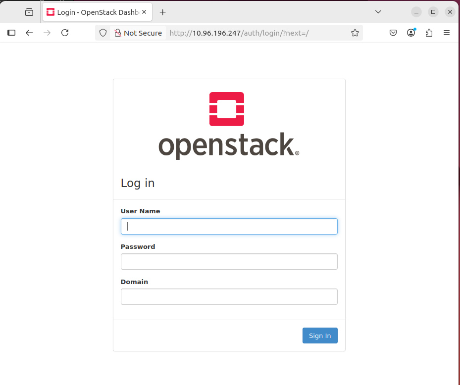  

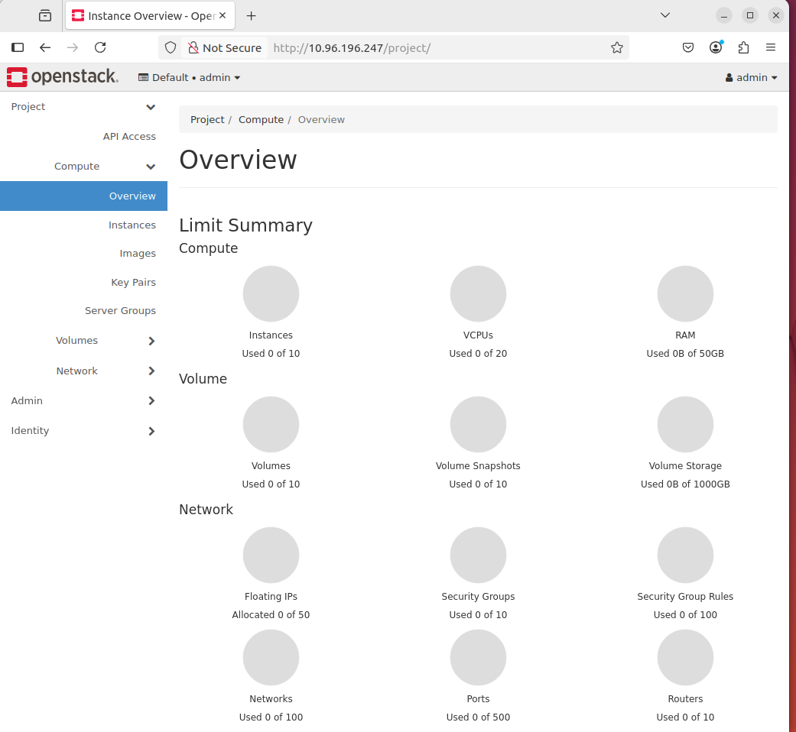


### 3.2. Openstack-client

📕129.254.175.93 노드에 openstack-client를 설치하여 확인

```shell
python3 -m venv ~/openstack-client
source ~/openstack-client/bin/activate
pip install python-openstackclient
```  

```shell
mkdir -p ~/.config/openstack
tee ~/.config/openstack/clouds.yaml << EOF
clouds:
  openstack_helm:
    region_name: RegionOne
    identity_api_version: 3
    auth:
      username: 'admin'
      password: 'password'
      project_name: 'admin'
      project_domain_name: 'default'
      user_domain_name: 'default'
      auth_url: 'http://keystone.openstack.svc.cluster.local/v3'
EOF
```  

```shell
##-- openstack 실행 결과 확인 >

(openstack-client) kcloud@kcloud-93:~/openstack-client$ openstack endpoint list
+----------------------------------+-----------+--------------+----------------+---------+-----------+---------------------------------------------------------------------+
| ID                               | Region    | Service Name | Service Type   | Enabled | Interface | URL                                                                 |
+----------------------------------+-----------+--------------+----------------+---------+-----------+---------------------------------------------------------------------+
| 0a8199c37044458f88e76cfd51e04b20 | RegionOne | heat-cfn     | cloudformation | True    | public    | http://cloudformation.openstack.svc.cluster.local/v1                |
| 0e56706737db4d66bd8a1eb55b6d9e0f | RegionOne | cinderv3     | volumev3       | True    | admin     | http://cinder-api.openstack.svc.cluster.local:8776/v3/%(tenant_id)s |
| 1cfa468f863e44b4a0d3f9af23576a7c | RegionOne | nova         | compute        | True    | internal  | http://nova-api.openstack.svc.cluster.local:8774/v2.1/%(tenant_id)s |
| 2bb1506e9b004eefa64531d635a7d410 | RegionOne | keystone     | identity       | True    | admin     | http://keystone.openstack.svc.cluster.local/v3                      |
| 31d67324959a470d868ac3924609d42a | RegionOne | heat         | orchestration  | True    | internal  | http://heat-api.openstack.svc.cluster.local:8004/v1/%(project_id)s  |
| 33fc62c24589480d9cf1ca2f6af196b8 | RegionOne | neutron      | network        | True    | internal  | http://neutron-server.openstack.svc.cluster.local:9696              |
| 38d167c867db4ac5a14187e888bde812 | RegionOne | neutron      | network        | True    | admin     | http://neutron-server.openstack.svc.cluster.local:9696              |
| 5126ea351ecb45739020eab632681d88 | RegionOne | neutron      | network        | True    | public    | http://neutron.openstack.svc.cluster.local                          |
| 565e2e286f2a438fb71ccace61bb620d | RegionOne | nova         | compute        | True    | admin     | http://nova-api.openstack.svc.cluster.local:8774/v2.1/%(tenant_id)s |
| 5fe99e2e31d843249ee177e04e9e3245 | RegionOne | heat-cfn     | cloudformation | True    | admin     | http://heat-cfn.openstack.svc.cluster.local:8000/v1                 |
| 70354d9c96054bea84e8b6547e066566 | RegionOne | heat         | orchestration  | True    | admin     | http://heat-api.openstack.svc.cluster.local:8004/v1/%(project_id)s  |
| 77c58cc55b444c0092f1b9f28da9e528 | RegionOne | keystone     | identity       | True    | public    | http://keystone.openstack.svc.cluster.local/v3                      |
| 812800a2a7c24b52a5b5690996cd1318 | RegionOne | heat         | orchestration  | True    | public    | http://heat.openstack.svc.cluster.local/v1/%(project_id)s           |
| 8ae0358548cd4df9862f21065d056972 | RegionOne | cinderv3     | volumev3       | True    | public    | http://cinder.openstack.svc.cluster.local/v3/%(tenant_id)s          |
| 8b5dfa4540c148508acfd3530f4380b3 | RegionOne | cinderv3     | volumev3       | True    | internal  | http://cinder-api.openstack.svc.cluster.local:8776/v3/%(tenant_id)s |
| 8ef071c5d6074312ad4d3e9cce62c7d0 | RegionOne | glance       | image          | True    | internal  | http://glance-api.openstack.svc.cluster.local:9292                  |
| bb663139504248f595de2a4ffb910179 | RegionOne | placement    | placement      | True    | internal  | http://placement-api.openstack.svc.cluster.local:8778/              |
| c58ae8c2258d4b2bbf18564d4aa8ae9a | RegionOne | nova         | compute        | True    | public    | http://nova.openstack.svc.cluster.local/v2.1/%(tenant_id)s          |
| e1c207cb8a4b41a39d208a3d261cade0 | RegionOne | keystone     | identity       | True    | internal  | http://keystone-api.openstack.svc.cluster.local:5000/v3             |
| e2dad0c10de54db890f63b863693f830 | RegionOne | heat-cfn     | cloudformation | True    | internal  | http://heat-cfn.openstack.svc.cluster.local:8000/v1                 |
| e5679325b59e4615bcf2f6a880bfae41 | RegionOne | glance       | image          | True    | public    | http://glance.openstack.svc.cluster.local                           |
| e5a3d458aa164892a5676941b268f5b2 | RegionOne | placement    | placement      | True    | admin     | http://placement-api.openstack.svc.cluster.local:8778/              |
| e8719762147449bcb567c90f575b618a | RegionOne | glance       | image          | True    | admin     | http://glance-api.openstack.svc.cluster.local:9292                  |
| ed370fd30d914308b32f61e6d5e9cca5 | RegionOne | placement    | placement      | True    | public    | http://placement.openstack.svc.cluster.local/                       |
+----------------------------------+-----------+--------------+----------------+---------+-----------+---------------------------------------------------------------------+

(openstack-client) kcloud@kcloud-93:~/openstack-client$ openstack compute service list
+--------------------------------------+----------------+---------------------------------+----------+---------+-------+----------------------------+
| ID                                   | Binary         | Host                            | Zone     | Status  | State | Updated At                 |
+--------------------------------------+----------------+---------------------------------+----------+---------+-------+----------------------------+
| 249bf10b-dc7c-4b5e-9786-c57171b7cd23 | nova-scheduler | nova-scheduler-555747c484-p7xzh | internal | enabled | up    | 2025-06-23T05:20:33.000000 |
| 84c38637-24ef-482d-80db-e599032a1b17 | nova-conductor | nova-conductor-7d984874b8-mrnr8 | internal | enabled | up    | 2025-06-23T05:20:33.000000 |
| 0227cae7-afb2-466a-b6f7-26dcd95cd056 | nova-compute   | kcloud-94                       | nova     | enabled | up    | 2025-06-23T05:20:29.000000 |
| e191dea7-9563-42bd-9af1-10dc7e3d1ad0 | nova-compute   | kcloud-93                       | nova     | enabled | up    | 2025-06-23T05:20:27.000000 |
+--------------------------------------+----------------+---------------------------------+----------+---------+-------+----------------------------+

(openstack-client) kcloud@kcloud-93:~/openstack-client$ openstack network agent list
+--------------------------------------+--------------------+-----------+-------------------+-------+-------+---------------------------+
| ID                                   | Agent Type         | Host      | Availability Zone | Alive | State | Binary                    |
+--------------------------------------+--------------------+-----------+-------------------+-------+-------+---------------------------+
| 09219847-d41a-4a78-bf5d-c232648cf04c | Open vSwitch agent | kcloud-94 | None              | :-)   | UP    | neutron-openvswitch-agent |
| 21931a27-8671-465f-b41a-4c24fe37c169 | L3 agent           | kcloud-94 | nova              | :-)   | UP    | neutron-l3-agent          |
| 3313e7b7-b558-406d-9c49-b7a4a9f5e069 | DHCP agent         | kcloud-94 | nova              | :-)   | UP    | neutron-dhcp-agent        |
| 48b2400b-0d84-4fb5-ab66-6446f6a3abaf | DHCP agent         | kcloud-93 | nova              | :-)   | UP    | neutron-dhcp-agent        |
| 660e6b2f-9a47-416d-8965-673bca1e06d6 | Open vSwitch agent | kcloud-93 | None              | :-)   | UP    | neutron-openvswitch-agent |
| b73433e7-7b35-4a45-aa04-e841de3b4ed7 | L3 agent           | kcloud-93 | nova              | :-)   | UP    | neutron-l3-agent          |
+--------------------------------------+--------------------+-----------+-------------------+-------+-------+---------------------------+

(openstack-client) kcloud@kcloud-93:~$ openstack project list
+----------------------------------+-----------------+
| ID                               | Name            |
+----------------------------------+-----------------+
| 9688bd1a517b402e982ecb241eca83a4 | internal_cinder |
| 99398cbdbcbf4da7967e5ec3a9f4e46e | admin           |
| c4c07dbb261c4286931d1fa391ff9d03 | service         |
+----------------------------------+-----------------+

(openstack-client) kcloud@kcloud-93:~$ openstack endpoint list
+----------------------------------+-----------+--------------+----------------+---------+-----------+---------------------------------------------------------------------+
| ID                               | Region    | Service Name | Service Type   | Enabled | Interface | URL                                                                 |
+----------------------------------+-----------+--------------+----------------+---------+-----------+---------------------------------------------------------------------+
| 0a8199c37044458f88e76cfd51e04b20 | RegionOne | heat-cfn     | cloudformation | True    | public    | http://cloudformation.openstack.svc.cluster.local/v1                |
| 0e56706737db4d66bd8a1eb55b6d9e0f | RegionOne | cinderv3     | volumev3       | True    | admin     | http://cinder-api.openstack.svc.cluster.local:8776/v3/%(tenant_id)s |
| 1cfa468f863e44b4a0d3f9af23576a7c | RegionOne | nova         | compute        | True    | internal  | http://nova-api.openstack.svc.cluster.local:8774/v2.1/%(tenant_id)s |
| 2bb1506e9b004eefa64531d635a7d410 | RegionOne | keystone     | identity       | True    | admin     | http://keystone.openstack.svc.cluster.local/v3                      |
| 31d67324959a470d868ac3924609d42a | RegionOne | heat         | orchestration  | True    | internal  | http://heat-api.openstack.svc.cluster.local:8004/v1/%(project_id)s  |
| 33fc62c24589480d9cf1ca2f6af196b8 | RegionOne | neutron      | network        | True    | internal  | http://neutron-server.openstack.svc.cluster.local:9696              |
| 38d167c867db4ac5a14187e888bde812 | RegionOne | neutron      | network        | True    | admin     | http://neutron-server.openstack.svc.cluster.local:9696              |
| 5126ea351ecb45739020eab632681d88 | RegionOne | neutron      | network        | True    | public    | http://neutron.openstack.svc.cluster.local                          |
| 565e2e286f2a438fb71ccace61bb620d | RegionOne | nova         | compute        | True    | admin     | http://nova-api.openstack.svc.cluster.local:8774/v2.1/%(tenant_id)s |
| 5fe99e2e31d843249ee177e04e9e3245 | RegionOne | heat-cfn     | cloudformation | True    | admin     | http://heat-cfn.openstack.svc.cluster.local:8000/v1                 |
| 70354d9c96054bea84e8b6547e066566 | RegionOne | heat         | orchestration  | True    | admin     | http://heat-api.openstack.svc.cluster.local:8004/v1/%(project_id)s  |
| 77c58cc55b444c0092f1b9f28da9e528 | RegionOne | keystone     | identity       | True    | public    | http://keystone.openstack.svc.cluster.local/v3                      |
| 812800a2a7c24b52a5b5690996cd1318 | RegionOne | heat         | orchestration  | True    | public    | http://heat.openstack.svc.cluster.local/v1/%(project_id)s           |
| 8ae0358548cd4df9862f21065d056972 | RegionOne | cinderv3     | volumev3       | True    | public    | http://cinder.openstack.svc.cluster.local/v3/%(tenant_id)s          |
| 8b5dfa4540c148508acfd3530f4380b3 | RegionOne | cinderv3     | volumev3       | True    | internal  | http://cinder-api.openstack.svc.cluster.local:8776/v3/%(tenant_id)s |
| 8ef071c5d6074312ad4d3e9cce62c7d0 | RegionOne | glance       | image          | True    | internal  | http://glance-api.openstack.svc.cluster.local:9292                  |
| bb663139504248f595de2a4ffb910179 | RegionOne | placement    | placement      | True    | internal  | http://placement-api.openstack.svc.cluster.local:8778/              |
| c58ae8c2258d4b2bbf18564d4aa8ae9a | RegionOne | nova         | compute        | True    | public    | http://nova.openstack.svc.cluster.local/v2.1/%(tenant_id)s          |
| e1c207cb8a4b41a39d208a3d261cade0 | RegionOne | keystone     | identity       | True    | internal  | http://keystone-api.openstack.svc.cluster.local:5000/v3             |
| e2dad0c10de54db890f63b863693f830 | RegionOne | heat-cfn     | cloudformation | True    | internal  | http://heat-cfn.openstack.svc.cluster.local:8000/v1                 |
| e5679325b59e4615bcf2f6a880bfae41 | RegionOne | glance       | image          | True    | public    | http://glance.openstack.svc.cluster.local                           |
| e5a3d458aa164892a5676941b268f5b2 | RegionOne | placement    | placement      | True    | admin     | http://placement-api.openstack.svc.cluster.local:8778/              |
| e8719762147449bcb567c90f575b618a | RegionOne | glance       | image          | True    | admin     | http://glance-api.openstack.svc.cluster.local:9292                  |
| ed370fd30d914308b32f61e6d5e9cca5 | RegionOne | placement    | placement      | True    | public    | http://placement.openstack.svc.cluster.local/                       |
+----------------------------------+-----------+--------------+----------------+---------+-----------+---------------------------------------------------------------------+

(openstack-client) kcloud@kcloud-93:~$ openstack image list
+--------------------------------------+---------------------+--------+
| ID                                   | Name                | Status |
+--------------------------------------+---------------------+--------+
| ec5ada88-b51e-4b76-9157-4f06cb998a76 | Cirros 0.6.2 64-bit | active |
+--------------------------------------+---------------------+--------+

(openstack-client) kcloud@kcloud-93:~$ openstack volume service list
+------------------+---------------------------+------+---------+-------+----------------------------+---------+---------------+
| Binary           | Host                      | Zone | Status  | State | Updated At                 | Cluster | Backend State |
+------------------+---------------------------+------+---------+-------+----------------------------+---------+---------------+
| cinder-scheduler | cinder-volume-worker      | nova | enabled | up    | 2025-06-23T07:37:10.000000 | None    | None          |
| cinder-backup    | cinder-volume-worker      | nova | enabled | up    | 2025-06-23T07:37:07.000000 | None    | None          |
| cinder-volume    | cinder-volume-worker@rbd1 | nova | enabled | up    | 2025-06-23T07:37:13.000000 | None    | None          |
+------------------+---------------------------+------+---------+-------+----------------------------+---------+---------------+
```


### 3.3. VM 인스턴스 생성 및 동작 확인  

OS 이미지 준비 ➡️ (생략가능) Project 생성 ➡️ (생략가능) 사용자 생성  
➡️ (생략가능) 사용자 역할 지정 ➡️ 외부 네트워크 생성 ➡️ 내부 네트워크 생성  
➡️ 라우터 생성 및 연결 ➡️ 보안 그룹 설정 ➡️ 키페어 생성 ➡️ 이미지 등록  
➡️ Flavor 생성 ➡️ VM 인스턴스 생성 ➡️ Floating IP 연결   

#### OS 이미지 준비 (img ➡️ qcow2)  

Openstack에서 사용할 Ubuntu 22.04의 qcow2 변환용 이미지 다운로드    
- [ubuntu-cloud-images (22.04, jammy)](https://cloud-images.ubuntu.com/jammy/current/)  
- 위 경로에서, jammy-server-cloudimg-amd64.img 다운로드
    - [jammy-server-cloudimg-amd64.img](https://cloud-images.ubuntu.com/jammy/current/jammy-server-cloudimg-amd64.img)
- file format이 `qcow2`이어야 한다.

```shell
sudo apt install qemu-utils -y
mkdir ~/openstack-img
mv ~/Downloads/jammy-server-cloudimg-amd64.img ~/openstack-img
qemu-img info ~/openstack-img/jammy-server-cloudimg-amd64.img

##-- 파일 포맷 확인 예 >
kcloud@kcloud-93:~$ mkdir ~/openstack-img
kcloud@kcloud-93:~$ mv ~/Downloads/jammy-server-cloudimg-amd64.img ~/openstack-img
kcloud@kcloud-93:~$ qemu-img info ~/openstack-img/jammy-server-cloudimg-amd64.img
image: /home/kcloud/openstack-img/jammy-server-cloudimg-amd64.img
file format: qcow2
virtual size: 2.2 GiB (2361393152 bytes)
disk size: 646 MiB
cluster_size: 65536
Format specific information:
    compat: 0.10
    compression type: zlib
    refcount bits: 16
```  

#### Project 생성 및 사용자 설정 (생략 가능)

- Project (Tenant)는 자원을 논리적으로 격리하는 단위 (VM, 네트워크, 볼륨 등)  
- User는 Openstack API와 Horizon을 사용할 수 있는 계정  

아래 과정은 하나의 openstack 클러스터에 여러 조직/팀이 자원 격리 및 권한 분리 하도록 설정하는 단계  
- ex) `damo` 프로젝트에 `devuser`는 VM을 생성할 수 있찌만, `admin`권한은 없음

```shell
##-- 프로젝트 생성
openstack project create demo --description "Demo Project"

##-- 사용자 생성
openstack user create --project demo --password 'demo1234' demo

##-- 역할 부여 (사용자에게 demo 프로젝트의 member 역할 부여)
openstack role add --project demo --user demo member
```  

```shell
##-- 실행 결과 예 >
(openstack-client) kcloud@kcloud-93:~$ openstack project create demo --description "Demo Project"
+-------------+----------------------------------+
| Field       | Value                            |
+-------------+----------------------------------+
| description | Demo Project                     |
| domain_id   | default                          |
| enabled     | True                             |
| id          | ad8477b673fe41cf941b1499ff362aed |
| is_domain   | False                            |
| name        | demo                             |
| options     | {}                               |
| parent_id   | default                          |
| tags        | []                               |
+-------------+----------------------------------+

(openstack-client) kcloud@kcloud-93:~$ openstack user create --project demo --password 'demo1234' demo
+---------------------+----------------------------------+
| Field               | Value                            |
+---------------------+----------------------------------+
| default_project_id  | ad8477b673fe41cf941b1499ff362aed |
| domain_id           | default                          |
| email               | None                             |
| enabled             | True                             |
| id                  | 46011da312684514984da6570b7c5b97 |
| name                | demo                             |
| description         | None                             |
| password_expires_at | None                             |
| options             | {}                               |
+---------------------+----------------------------------+

(openstack-client) kcloud@kcloud-93:~$ openstack role add --project demo --user demo member
(openstack-client) kcloud@kcloud-93:~$ openstack role assignment list --user demo --project demo --names
+--------+--------------+-------+--------------+--------+--------+-----------+
| Role   | User         | Group | Project      | Domain | System | Inherited |
+--------+--------------+-------+--------------+--------+--------+-----------+
| member | demo@Default |       | demo@Default |        |        | False     |
+--------+--------------+-------+--------------+--------+--------+-----------+
``` 


#### 외부 네트워크 구성

`~/osh/openstack-helm/neutron/values.yaml`의 설정 값을 확인한 후, provider-physical-network를 지정

```shell
##-- bridge_mappgins의 : 앞 쪽 이름이 provider-physical-network로 지정되어야 함

kcloud@kcloud-64:~/osh/openstack-helm/neutron$ grep -rnI "bridge_mapping" -A 3 -B 3 .
./values.yaml-2095-        l2_population: True
./values.yaml-2096-        arp_responder: True
./values.yaml-2097-      ovs:
./values.yaml:2098:        bridge_mappings: "external:br-ex"
./values.yaml-2099-      securitygroup:
./values.yaml-2100-        firewall_driver: neutron.agent.linux.iptables_firewall.OVSHybridIptablesFirewallDriver
./values.yaml-2101-    linuxbridge_agent:
--
./values.yaml-2104-        # specific interface to the flat/vlan network name using:
./values.yaml-2105-        # physical_interface_mappings: "external:eth3"
./values.yaml-2106-        # Or we can set the mapping between the network and bridge:
./values.yaml:2107:        bridge_mappings: "external:br-ex"
./values.yaml-2108-        # The two above options are exclusive, do not use both of them at once
./values.yaml-2109-      securitygroup:
./values.yaml-2110-        firewall_driver: iptables

##-- 실제 반영이 위와 같이 되었는지 확인 후 아래 명령 수행 필요
kcloud@kcloud-64:~/osh$ kubectl -n openstack exec -it neutron-ovs-agent-default-28blx -- bash
Defaulted container "neutron-ovs-agent" out of: neutron-ovs-agent, init (init), neutron-openvswitch-agent-kernel-modules (init), neutron-ovs-agent-init (init)

neutron@kcloud-94:/$ cat /etc/neutron/plugins/ml2/openvswitch_agent.ini | grep bridge_mappings
bridge_mappings = public:br-ex
``` 

📗위 결과를 보면, neutron에 실행되는 agent에는 `bridge_mappgins`가 `public`으로 명명됨  
- 따라서, 아래 명령의 `--provider-physical-network`를 `public`으로 작성한다.

```shell
openstack network create public-net \
  --external \
  --provider-network-type flat \
  --provider-physical-network public \
  --share
```  

```shell
##-- 실행 결과 예 >
(openstack-client) kcloud@kcloud-93:~$ openstack network create public-net \
  --external \
  --provider-network-type flat \
  --provider-physical-network public \
  --share
+---------------------------+--------------------------------------+
| Field                     | Value                                |
+---------------------------+--------------------------------------+
| admin_state_up            | UP                                   |
| availability_zone_hints   | nova                                 |
| availability_zones        |                                      |
| created_at                | 2025-06-24T02:22:34Z                 |
| description               |                                      |
| dns_domain                | None                                 |
| id                        | df16ecfd-a9f7-4a5f-98b1-47aa3e7ac9ae |
| ipv4_address_scope        | None                                 |
| ipv6_address_scope        | None                                 |
| is_default                | False                                |
| is_vlan_qinq              | None                                 |
| is_vlan_transparent       | None                                 |
| mtu                       | 1500                                 |
| name                      | public-net                           |
| port_security_enabled     | True                                 |
| project_id                | d6ba02177cab4aa080e4970dc673998d     |
| provider:network_type     | flat                                 |
| provider:physical_network | public                               |
| provider:segmentation_id  | None                                 |
| qos_policy_id             | None                                 |
| revision_number           | 1                                    |
| router:external           | External                             |
| segments                  | None                                 |
| shared                    | True                                 |
| status                    | ACTIVE                               |
| subnets                   |                                      |
| tags                      |                                      |
| updated_at                | 2025-06-24T02:22:34Z                 |
+---------------------------+--------------------------------------+
```  

📙가상머신이 실행되는 노드에서 가상머신에 직접 접근하려면  
- subnet-range, gateway, allocation-pool을 노드와 같은 대역으로 설정해야 한다  
    - ex) 129.254.202.0/24, 129.254.202.1, 129.254.202.100~129.254.202.120

```shell
openstack subnet create public-subnet \
  --network public-net \
  --subnet-range 192.168.0.0/24 \
  --no-dhcp \
  --gateway 192.168.0.1 \
  --allocation-pool start=192.168.0.100,end=192.168.0.200
```  

```shell
##-- 실행 결과 예 >
(openstack-client) kcloud@kcloud-93:~$ openstack subnet create public-subnet \
  --network public-net \
  --subnet-range 192.168.0.0/24 \
  --no-dhcp \
  --gateway 192.168.0.1 \
  --allocation-pool start=192.168.0.100,end=192.168.0.200
+----------------------+--------------------------------------+
| Field                | Value                                |
+----------------------+--------------------------------------+
| allocation_pools     | 192.168.0.100-192.168.0.200          |
| cidr                 | 192.168.0.0/24                       |
| created_at           | 2025-06-24T02:22:52Z                 |
| description          |                                      |
| dns_nameservers      |                                      |
| dns_publish_fixed_ip | None                                 |
| enable_dhcp          | False                                |
| gateway_ip           | 192.168.0.1                          |
| host_routes          |                                      |
| id                   | 2f74c22e-850c-4dcd-b89c-0ffb49b220e7 |
| ip_version           | 4                                    |
| ipv6_address_mode    | None                                 |
| ipv6_ra_mode         | None                                 |
| name                 | public-subnet                        |
| network_id           | df16ecfd-a9f7-4a5f-98b1-47aa3e7ac9ae |
| project_id           | d6ba02177cab4aa080e4970dc673998d     |
| revision_number      | 0                                    |
| router:external      | True                                 |
| segment_id           | None                                 |
| service_types        |                                      |
| subnetpool_id        | None                                 |
| tags                 |                                      |
| updated_at           | 2025-06-24T02:22:52Z                 |
+----------------------+--------------------------------------+
```  

#### 내부 네트워크 구성  

```shell
openstack network create private-net

openstack subnet create private-subnet \
  --network private-net \
  --subnet-range 192.168.100.0/24 \
  --gateway 192.168.100.1 \
  --dns-nameserver 8.8.8.8
```  

```shell
##-- 실행 결과 예 >
(openstack-client) kcloud@kcloud-93:~$ openstack network create private-net

openstack subnet create private-subnet \
  --network private-net \
  --subnet-range 192.168.100.0/24 \
  --gateway 192.168.100.1 \
  --dns-nameserver 8.8.8.8
+---------------------------+--------------------------------------+
| Field                     | Value                                |
+---------------------------+--------------------------------------+
| admin_state_up            | UP                                   |
| availability_zone_hints   | nova                                 |
| availability_zones        |                                      |
| created_at                | 2025-06-24T02:23:17Z                 |
| description               |                                      |
| dns_domain                | None                                 |
| id                        | 3cd8e7b8-9bfd-4901-b3e0-b7dddff1e722 |
| ipv4_address_scope        | None                                 |
| ipv6_address_scope        | None                                 |
| is_default                | None                                 |
| is_vlan_qinq              | None                                 |
| is_vlan_transparent       | None                                 |
| mtu                       | 1450                                 |
| name                      | private-net                          |
| port_security_enabled     | True                                 |
| project_id                | d6ba02177cab4aa080e4970dc673998d     |
| provider:network_type     | vxlan                                |
| provider:physical_network | None                                 |
| provider:segmentation_id  | 61                                   |
| qos_policy_id             | None                                 |
| revision_number           | 1                                    |
| router:external           | Internal                             |
| segments                  | None                                 |
| shared                    | False                                |
| status                    | ACTIVE                               |
| subnets                   |                                      |
| tags                      |                                      |
| updated_at                | 2025-06-24T02:23:17Z                 |
+---------------------------+--------------------------------------+
+----------------------+--------------------------------------+
| Field                | Value                                |
+----------------------+--------------------------------------+
| allocation_pools     | 192.168.100.2-192.168.100.254        |
| cidr                 | 192.168.100.0/24                     |
| created_at           | 2025-06-24T02:23:18Z                 |
| description          |                                      |
| dns_nameservers      | 8.8.8.8                              |
| dns_publish_fixed_ip | None                                 |
| enable_dhcp          | True                                 |
| gateway_ip           | 192.168.100.1                        |
| host_routes          |                                      |
| id                   | 830efd0f-e622-43cb-a571-22d38305deb9 |
| ip_version           | 4                                    |
| ipv6_address_mode    | None                                 |
| ipv6_ra_mode         | None                                 |
| name                 | private-subnet                       |
| network_id           | 3cd8e7b8-9bfd-4901-b3e0-b7dddff1e722 |
| project_id           | d6ba02177cab4aa080e4970dc673998d     |
| revision_number      | 0                                    |
| router:external      | False                                |
| segment_id           | None                                 |
| service_types        |                                      |
| subnetpool_id        | None                                 |
| tags                 |                                      |
| updated_at           | 2025-06-24T02:23:18Z                 |
+----------------------+--------------------------------------+
```  

#### 라우터 생성 및 연결

```shell
openstack router create router1

##-- 외부 네트워크 게이트웨이 연결
openstack router set router1 --external-gateway public-net

##-- 내부 서브넷 인터페이스 추가
openstack router add subnet router1 private-subnet
```  

```shell
##-- 실행 결과 예 >
(openstack-client) kcloud@kcloud-93:~$ openstack router create router1
+-------------------------+--------------------------------------+
| Field                   | Value                                |
+-------------------------+--------------------------------------+
| admin_state_up          | UP                                   |
| availability_zone_hints | nova                                 |
| availability_zones      |                                      |
| created_at              | 2025-06-24T02:25:08Z                 |
| description             |                                      |
| distributed             | False                                |
| enable_ndp_proxy        | None                                 |
| external_gateway_info   | null                                 |
| flavor_id               | None                                 |
| ha                      | False                                |
| id                      | 33221204-bfb5-437e-9f4b-4f457466ce1e |
| name                    | router1                              |
| project_id              | d6ba02177cab4aa080e4970dc673998d     |
| revision_number         | 1                                    |
| routes                  |                                      |
| status                  | ACTIVE                               |
| tags                    |                                      |
| updated_at              | 2025-06-24T02:25:08Z                 |
+-------------------------+--------------------------------------+
(openstack-client) kcloud@kcloud-93:~$ openstack router set router1 --external-gateway public-net
(openstack-client) kcloud@kcloud-93:~$ openstack router add subnet router1 private-subnet
```  

📗참고 (VM의 floating IP)  

- 모든 가상머신에 floating IP를 할당하지 않으려면  
    - NAT Gateway/Bastion Host 패턴
        - 외부에 floating IP가 붙은 VM (ex) Jumpbox, Bastion) 하나만 운영
        - 다른 VM은 내부 네트워크에만 있음
        - [client] ➡️ [Floating IP: Bastion] ➡️ [Private Net: VM]
    - Load Balancer (Octavia) 패턴
        - 여러 VM이 하나의 서비스(ex) 웹서버) 제공
        - flaoting IP는 LB에만 할당
        - [client] ➡️ [Floating IP: LB] ➡️ [Backend Pool: VM]
    - SNAT-only 패턴
        - VM에서 외부로의 통신만 필요할 때
        - [VM Internal IP] ➡️ [Neutron Router] ➡️ [SNAT IP(공유)] ➡️ [External Network]  


#### 보안 그룹 설정 및 키페어

보안그룹 생성

```shell
openstack security group rule create default --proto tcp --dst-port 22
openstack security group rule create default --proto icmp
```  

```shell
##-- 실행 결과 예 >
(openstack-client) kcloud@kcloud-93:~/openstack-img$ openstack security group list
+--------------------------------------+---------+------------------------+----------------------------------+------+
| ID                                   | Name    | Description            | Project                          | Tags |
+--------------------------------------+---------+------------------------+----------------------------------+------+
| 1e638778-864c-41e3-aa0e-492a7f47b09d | default | Default security group | 000de077c3ef4ccfb1d85bc5016363c1 | []   |
+--------------------------------------+---------+------------------------+----------------------------------+------+
(openstack-client) kcloud@kcloud-93:~/openstack-img$ openstack security group rule list default
+--------------------------------------+-------------+-----------+-----------+------------+-----------+--------------------------------------+----------------------+
| ID                                   | IP Protocol | Ethertype | IP Range  | Port Range | Direction | Remote Security Group                | Remote Address Group |
+--------------------------------------+-------------+-----------+-----------+------------+-----------+--------------------------------------+----------------------+
| 289207cc-92a4-451c-aef6-db44f3e71796 | None        | IPv6      | ::/0      |            | egress    | None                                 | None                 |
| 543f0784-485f-47f8-bea3-3785fa408f94 | None        | IPv4      | 0.0.0.0/0 |            | egress    | None                                 | None                 |
| 81a1676e-eb4c-40f1-ad1e-460e40665930 | None        | IPv4      | 0.0.0.0/0 |            | ingress   | 1e638778-864c-41e3-aa0e-492a7f47b09d | None                 |
| de566c82-bf4a-4236-8a62-75f4db560f2e | None        | IPv6      | ::/0      |            | ingress   | 1e638778-864c-41e3-aa0e-492a7f47b09d | None                 |
+--------------------------------------+-------------+-----------+-----------+------------+-----------+--------------------------------------+----------------------+
(openstack-client) kcloud@kcloud-93:~/openstack-img$ openstack security group rule create default --proto tcp --dst-port 22
+-------------------------+--------------------------------------+
| Field                   | Value                                |
+-------------------------+--------------------------------------+
| belongs_to_default_sg   | True                                 |
| created_at              | 2025-07-09T09:48:35Z                 |
| description             |                                      |
| direction               | ingress                              |
| ether_type              | IPv4                                 |
| id                      | fa80cc89-097f-4cdc-979d-36dafb8acd9c |
| normalized_cidr         | 0.0.0.0/0                            |
| port_range_max          | 22                                   |
| port_range_min          | 22                                   |
| project_id              | 000de077c3ef4ccfb1d85bc5016363c1     |
| protocol                | tcp                                  |
| remote_address_group_id | None                                 |
| remote_group_id         | None                                 |
| remote_ip_prefix        | 0.0.0.0/0                            |
| revision_number         | 0                                    |
| security_group_id       | 1e638778-864c-41e3-aa0e-492a7f47b09d |
| updated_at              | 2025-07-09T09:48:35Z                 |
+-------------------------+--------------------------------------+
(openstack-client) kcloud@kcloud-93:~/openstack-img$ openstack security group rule list default
+--------------------------------------+-------------+-----------+-----------+------------+-----------+--------------------------------------+----------------------+
| ID                                   | IP Protocol | Ethertype | IP Range  | Port Range | Direction | Remote Security Group                | Remote Address Group |
+--------------------------------------+-------------+-----------+-----------+------------+-----------+--------------------------------------+----------------------+
| 289207cc-92a4-451c-aef6-db44f3e71796 | None        | IPv6      | ::/0      |            | egress    | None                                 | None                 |
| 543f0784-485f-47f8-bea3-3785fa408f94 | None        | IPv4      | 0.0.0.0/0 |            | egress    | None                                 | None                 |
| 81a1676e-eb4c-40f1-ad1e-460e40665930 | None        | IPv4      | 0.0.0.0/0 |            | ingress   | 1e638778-864c-41e3-aa0e-492a7f47b09d | None                 |
| de566c82-bf4a-4236-8a62-75f4db560f2e | None        | IPv6      | ::/0      |            | ingress   | 1e638778-864c-41e3-aa0e-492a7f47b09d | None                 |
| fa80cc89-097f-4cdc-979d-36dafb8acd9c | tcp         | IPv4      | 0.0.0.0/0 | 22:22      | ingress   | None                                 | None                 |
+--------------------------------------+-------------+-----------+-----------+------------+-----------+--------------------------------------+----------------------+
(openstack-client) kcloud@kcloud-93:~/openstack-img$ openstack security group rule create default --proto icmp
+-------------------------+--------------------------------------+
| Field                   | Value                                |
+-------------------------+--------------------------------------+
| belongs_to_default_sg   | True                                 |
| created_at              | 2025-07-09T09:48:50Z                 |
| description             |                                      |
| direction               | ingress                              |
| ether_type              | IPv4                                 |
| id                      | 8541a210-db01-426c-a6a8-1bae0e772782 |
| normalized_cidr         | 0.0.0.0/0                            |
| port_range_max          | None                                 |
| port_range_min          | None                                 |
| project_id              | 000de077c3ef4ccfb1d85bc5016363c1     |
| protocol                | icmp                                 |
| remote_address_group_id | None                                 |
| remote_group_id         | None                                 |
| remote_ip_prefix        | 0.0.0.0/0                            |
| revision_number         | 0                                    |
| security_group_id       | 1e638778-864c-41e3-aa0e-492a7f47b09d |
| updated_at              | 2025-07-09T09:48:50Z                 |
+-------------------------+--------------------------------------+
(openstack-client) kcloud@kcloud-93:~/openstack-img$ openstack security group rule list default
+--------------------------------------+-------------+-----------+-----------+------------+-----------+--------------------------------------+----------------------+
| ID                                   | IP Protocol | Ethertype | IP Range  | Port Range | Direction | Remote Security Group                | Remote Address Group |
+--------------------------------------+-------------+-----------+-----------+------------+-----------+--------------------------------------+----------------------+
| 289207cc-92a4-451c-aef6-db44f3e71796 | None        | IPv6      | ::/0      |            | egress    | None                                 | None                 |
| 543f0784-485f-47f8-bea3-3785fa408f94 | None        | IPv4      | 0.0.0.0/0 |            | egress    | None                                 | None                 |
| 81a1676e-eb4c-40f1-ad1e-460e40665930 | None        | IPv4      | 0.0.0.0/0 |            | ingress   | 1e638778-864c-41e3-aa0e-492a7f47b09d | None                 |
| 8541a210-db01-426c-a6a8-1bae0e772782 | icmp        | IPv4      | 0.0.0.0/0 |            | ingress   | None                                 | None                 |
| de566c82-bf4a-4236-8a62-75f4db560f2e | None        | IPv6      | ::/0      |            | ingress   | 1e638778-864c-41e3-aa0e-492a7f47b09d | None                 |
| fa80cc89-097f-4cdc-979d-36dafb8acd9c | tcp         | IPv4      | 0.0.0.0/0 | 22:22      | ingress   | None                                 | None                 |
```


📕(테스트용) k8s master node에서 직접 실행(primary가 아님)  
- 이 때, ssh 공개키가 필요하다.  

  ```shell
  ssh-keygen -t rsa -b 2048 -N "" -f ~/.ssh/id_rsa
  
  ##-- 실행 예 >
  (openstack-client) kcloud@kcloud-93:~$   ssh-keygen -t rsa -b 2048 -N "" -f ~/.ssh/id_rsa
  Generating public/private rsa key pair.
  Your identification has been saved in /home/kcloud/.ssh/id_rsa
  Your public key has been saved in /home/kcloud/.ssh/id_rsa.pub
  The key fingerprint is:
  SHA256:H+vCeKpfWzShFwthlszjEZ0bD4/O56g9cZdj38x/WYc kcloud@kcloud-93
  The key's randomart image is:
  +---[RSA 2048]----+
  |       o=+ .     |
  |       o*.=      |
  |       ..ooB     |
  |        .oo+o    |
  |        So*    o |
  |         +++o E o|
  |       o. +* o ==|
  |      ..+=o .  .*|
  |    .oooooo.    +|
  +----[SHA256]-----+
  ```  

키페어 생성

```shell
openstack keypair create --public-key ~/.ssh/id_rsa.pub mykey
```

```shell
##-- 실행 결과 예 >
(openstack-client) kcloud@kcloud-93:~$ openstack keypair create --public-key ~/.ssh/id_rsa.pub mykey
+-------------+-------------------------------------------------+
| Field       | Value                                           |
+-------------+-------------------------------------------------+
| created_at  | None                                            |
| fingerprint | 50:21:90:78:42:e1:6c:3d:2e:b6:a2:e1:23:7a:7f:49 |
| id          | mykey                                           |
| is_deleted  | None                                            |
| name        | mykey                                           |
| type        | ssh                                             |
| user_id     | 88482f607cc8497286dbc41e88d8f813                |
+-------------+-------------------------------------------------+
```  

#### 이미지 등록

```shell
cd ~/openstack-img/

openstack image create "ubuntu22.04" \
  --file jammy-server-cloudimg-amd64.img \
  --disk-format qcow2 \
  --container-format bare \
  --public
```

```shell
##-- 실행 결과 예 >
(openstack-client) kcloud@kcloud-93:~/openstack-img$ openstack image create "ubuntu22.04" \
  --file jammy-server-cloudimg-amd64.img \
  --disk-format qcow2 \
  --container-format bare \
  --public
+------------------+--------------------------------------------------------------------------------------------------------------------------+
| Field            | Value                                                                                                                    |
+------------------+--------------------------------------------------------------------------------------------------------------------------+
| checksum         | 1fb7e7d186125b47c89f9508a9fde383                                                                                         |
| container_format | bare                                                                                                                     |
| created_at       | 2025-06-24T02:35:33Z                                                                                                     |
| disk_format      | qcow2                                                                                                                    |
| file             | /v2/images/0e4d8754-ca10-4638-98bf-dcf0a620f19c/file                                                                     |
| id               | 0e4d8754-ca10-4638-98bf-dcf0a620f19c                                                                                     |
| min_disk         | 0                                                                                                                        |
| min_ram          | 0                                                                                                                        |
| name             | ubuntu22.04                                                                                                              |
| owner            | d6ba02177cab4aa080e4970dc673998d                                                                                         |
| properties       | os_hash_algo='sha512', os_hash_value='9f93175a873b98dbf5edb2e3216c58d9e7b05ab6f8c508636a3c0efe2654766831b6841f33e52ccb9c |
|                  | ab5f900237ba0796298b72ef2f58c5fa081758322b1fbd', os_hidden='False', owner_specified.openstack.md5='',                    |
|                  | owner_specified.openstack.object='images/ubuntu22.04', owner_specified.openstack.sha256='', stores='file'                |
| protected        | False                                                                                                                    |
| schema           | /v2/schemas/image                                                                                                        |
| size             | 677594624                                                                                                                |
| status           | active                                                                                                                   |
| tags             |                                                                                                                          |
| updated_at       | 2025-06-24T02:35:42Z                                                                                                     |
| virtual_size     | 2361393152                                                                                                               |
| visibility       | public                                                                                                                   |
+------------------+--------------------------------------------------------------------------------------------------------------------------+
```

#### (선택) PCI Passthrough

PCI ID 확인  
- NVIDIA GPU A30
    - 10de:20b7
- Furiosa AI Warboy
    - 1ed2:0000

```shell
lspci -nnk | grep -i nvidia
##-- 출력 예 >
kcloud@kcloud-241:~$ lspci -nnk | grep -i nvidia
18:00.0 3D controller [0302]: NVIDIA Corporation GA100GL [A30 PCIe] [10de:20b7] (rev a1)
        Subsystem: NVIDIA Corporation GA100GL [A30 PCIe] [10de:1532]
        Kernel modules: nvidiafb, nouveau

lspci -nnk -s 18:00
##-- 출력 예 >
kcloud@kcloud-241:~$ lspci -nnk -s 18:00
18:00.0 3D controller [0302]: NVIDIA Corporation GA100GL [A30 PCIe] [10de:20b7] (rev a1)
        Subsystem: NVIDIA Corporation GA100GL [A30 PCIe] [10de:1532]
        Kernel modules: nvidiafb, nouveau

lspci -nnk | grep -i furiosa
##-- 출력 예 >
kcloud@kcloud-241:~$ lspci -nnk | grep -i furiosa
af:00.0 Processing accelerators [1200]: FuriosaAI, Inc. Warboy [1ed2:0000] (rev 01)
        Subsystem: FuriosaAI, Inc. Warboy [1ed2:0000]

lspci -nnk -s 18:00.0
##-- 출력 예 >
kcloud@kcloud-241:~$ lspci -nnk -s af:00

```

Passthorugh 설정

```shell
sudo vim /etc/default/grub
##-- vfio-cpi 부분 추가 > 
GRUB_CMDLINE_LINUX_DEFAULT="quiet splash intel_iommu=on vfio-pci.ids=10de:20b7,1ed2:0000"

cat <<EOF | sudo tee /etc/modprobe.d/vfio.conf
softdep nvidia pre: vfio-pci
options vfio-pci ids=10de:20b7
EOF

cat <<EOF | sudo tee /etc/modprobe.d/blacklist-nvidia.conf
blacklist nouveau
blacklist nvidiafb
EOF

cat << EOF | sudo tee -a /etc/modules-load.d/modules.conf
vfio
vfio_iommu_type1
vfio_pci
EOF

##-- 드라이버/블랙리스트 변경 시, 초기 RAM 디스크 이미지 생성/갱신 (initramfs)
sudo update-initramfs -u
##-- 커널 파라미터 변경 시, GRUB 설정 파일(grub.cfg) 재생성
sudo update-grub
sudo reboot
```
 
적용 확인  
- `Kernel driver in use: vfio-pci` 명시되어야 함

```shell
lspci -nnk -s 18:00
# > 출력예
(base) root@kcloud-241:~# lspci -nnk -s 18:00
18:00.0 3D controller [0302]: NVIDIA Corporation GA100GL [A30 PCIe] [10de:20b7] (rev a1)
        Subsystem: NVIDIA Corporation GA100GL [A30 PCIe] [10de:1532]
        Kernel driver in use: vfio-pci
        Kernel modules: nvidiafb, nouveau
```  

#### VM 인스턴스 생성

##### VM (ID/PW 접근)  

📕생성한 가상머신을 Console에서 ID/PW 기반으로 접근하기 위해 아래 작업 필요  
- 네트워크 설정이 완료되어 ssh 접근이 가능하면 생략하여도 무방  

```shell
##-- openstack-client 및 cloud-img가 있는 노드에서 실행
##-- 현재 시스템의 경우, 129.254.175.93 노드
##-- 생성 VM ID:PASSWORD 접근 설정 (ubuntu:ubuntu)
cd ~/openstack-img

cat > ubuntu-user-data.yaml <<EOF
#cloud-config
users:
  - name: ubuntu
    groups: sudo
    shell: /bin/bash
    sudo: ALL=(ALL) NOPASSWD:ALL
    lock_passwd: false
ssh_pwauth: true
chpasswd:
  list: |
    ubuntu:ubuntu
  expire: false
EOF
```

##### VM (일반)

📕앞 서, ID/PW 기반으로 접근하지 않을 경우, 아래 --user-data 부분을 없애면 된다.

```shell
##-- flavor 생성
openstack flavor create --ram 2048 --vcpus 2 --disk 20 m1.small.test

##-- security-group id 확인
openstack security group list

##-- default security-group의 id 활용
openstack server create test-vm \
  --image ubuntu22.04 \
  --flavor m1.small.test \
  --network private-net \
  --key-name mykey \
  --user-data ubuntu-user-data.yaml \
  --security-group 1e638778-864c-41e3-aa0e-492a7f47b09d
```  

```shell
##-- 실행 결과 예 >
(openstack-client) kcloud@kcloud-93:~/openstack-img$ openstack flavor create --ram 2048 --vcpus 2 --disk 20 m1.small.test
+----------------------------+--------------------------------------+
| Field                      | Value                                |
+----------------------------+--------------------------------------+
| OS-FLV-DISABLED:disabled   | False                                |
| OS-FLV-EXT-DATA:ephemeral  | 0                                    |
| description                | None                                 |
| disk                       | 20                                   |
| id                         | b6cfba1a-c642-4421-9919-922162a2b94b |
| name                       | m1.small.test                        |
| os-flavor-access:is_public | True                                 |
| properties                 |                                      |
| ram                        | 2048                                 |
| rxtx_factor                | 1.0                                  |
| swap                       | 0                                    |
| vcpus                      | 2                                    |
+----------------------------+--------------------------------------+

(openstack-client) kcloud@kcloud-93:~/openstack-img$ openstack security group list
+--------------------------------------+---------+------------------------+----------------------------------+------+
| ID                                   | Name    | Description            | Project                          | Tags |
+--------------------------------------+---------+------------------------+----------------------------------+------+
| 1e638778-864c-41e3-aa0e-492a7f47b09d | default | Default security group | 000de077c3ef4ccfb1d85bc5016363c1 | []   |
+--------------------------------------+---------+------------------------+----------------------------------+------+


(openstack-client) kcloud@kcloud-93:~/openstack-img$ openstack server create test-vm \
  --image ubuntu22.04 \
  --flavor m1.small.test \
  --network private-net \
  --key-name mykey \
  --user-data ubuntu-user-data.yaml \
  --security-group 1e638778-864c-41e3-aa0e-492a7f47b09d
+-------------------------------------+-----------------------------------------------------------------------------------------------------------------------------------------------------+
| Field                               | Value                                                                                                                                               |
+-------------------------------------+-----------------------------------------------------------------------------------------------------------------------------------------------------+
| OS-DCF:diskConfig                   | MANUAL                                                                                                                                              |
| OS-EXT-AZ:availability_zone         | None                                                                                                                                                |
| OS-EXT-SRV-ATTR:host                | None                                                                                                                                                |
| OS-EXT-SRV-ATTR:hostname            | test-vm                                                                                                                                             |
| OS-EXT-SRV-ATTR:hypervisor_hostname | None                                                                                                                                                |
| OS-EXT-SRV-ATTR:instance_name       | None                                                                                                                                                |
| OS-EXT-SRV-ATTR:kernel_id           | None                                                                                                                                                |
| OS-EXT-SRV-ATTR:launch_index        | None                                                                                                                                                |
| OS-EXT-SRV-ATTR:ramdisk_id          | None                                                                                                                                                |
| OS-EXT-SRV-ATTR:reservation_id      | r-8db8r9hs                                                                                                                                          |
| OS-EXT-SRV-ATTR:root_device_name    | None                                                                                                                                                |
| OS-EXT-SRV-ATTR:user_data           | I2Nsb3VkLWNvbmZpZwp1c2VyczoKICAtIG5hbWU6IHVidW50dQogICAgZ3JvdXBzOiBzdWRvCiAgICBzaGVsbDogL2Jpbi9iYXNoCiAgICBzdWRvOiBBTEw9KEFMTCkgTk9QQVNTV0Q6QUxMCiA |
|                                     | gICBsb2NrX3Bhc3N3ZDogZmFsc2UKc3NoX3B3YXV0aDogdHJ1ZQpjaHBhc3N3ZDoKICBsaXN0OiB8CiAgICB1YnVudHU6dWJ1bnR1CiAgZXhwaXJlOiBmYWxzZQo=                       |
| OS-EXT-STS:power_state              | N/A                                                                                                                                                 |
| OS-EXT-STS:task_state               | scheduling                                                                                                                                          |
| OS-EXT-STS:vm_state                 | building                                                                                                                                            |
| OS-SRV-USG:launched_at              | None                                                                                                                                                |
| OS-SRV-USG:terminated_at            | None                                                                                                                                                |
| accessIPv4                          | None                                                                                                                                                |
| accessIPv6                          | None                                                                                                                                                |
| addresses                           | N/A                                                                                                                                                 |
| adminPass                           | 3TSHUhjpfiM6                                                                                                                                        |
| config_drive                        | None                                                                                                                                                |
| created                             | 2025-07-09T09:51:59Z                                                                                                                                |
| description                         | None                                                                                                                                                |
| flavor                              | description=, disk='20', ephemeral='0', , id='m1.small.test', is_disabled=, is_public='True', location=, name='m1.small.test',                      |
|                                     | original_name='m1.small.test', ram='2048', rxtx_factor=, swap='0', vcpus='2'                                                                        |
| hostId                              | None                                                                                                                                                |
| host_status                         | None                                                                                                                                                |
| id                                  | f194ed4e-00ed-4ff7-8587-09511734c87b                                                                                                                |
| image                               | ubuntu22.04 (f710faf1-42e2-4fc3-8801-c427489d6f88)                                                                                                  |
| key_name                            | mykey                                                                                                                                               |
| locked                              | None                                                                                                                                                |
| locked_reason                       | None                                                                                                                                                |
| name                                | test-vm                                                                                                                                             |
| pinned_availability_zone            | None                                                                                                                                                |
| progress                            | None                                                                                                                                                |
| project_id                          | 000de077c3ef4ccfb1d85bc5016363c1                                                                                                                    |
| properties                          | None                                                                                                                                                |
| scheduler_hints                     |                                                                                                                                                     |
| security_groups                     | name='1e638778-864c-41e3-aa0e-492a7f47b09d'                                                                                                         |
| server_groups                       | None                                                                                                                                                |
| status                              | BUILD                                                                                                                                               |
| tags                                |                                                                                                                                                     |
| trusted_image_certificates          | None                                                                                                                                                |
| updated                             | 2025-07-09T09:51:59Z                                                                                                                                |
| user_id                             | 769983b5cdd44aa6ab91ea013daed121                                                                                                                    |
| volumes_attached                    |                                                                                                                                                     |
+-------------------------------------+-----------------------------------------------------------------------------------------------------------------------------------------------------+

(openstack-client) kcloud@kcloud-93:~$ openstack server show test-vm
+-------------------------------------+-------------------------------------------------------------------------------------------------------+
| Field                               | Value                                                                                                 |
+-------------------------------------+-------------------------------------------------------------------------------------------------------+
| OS-DCF:diskConfig                   | MANUAL                                                                                                |
| OS-EXT-AZ:availability_zone         | nova                                                                                                  |
| OS-EXT-SRV-ATTR:host                | kcloud-94                                                                                             |
| OS-EXT-SRV-ATTR:hostname            | test-vm                                                                                               |
| OS-EXT-SRV-ATTR:hypervisor_hostname | kcloud-94                                                                                             |
| OS-EXT-SRV-ATTR:instance_name       | instance-00000001                                                                                     |
| OS-EXT-SRV-ATTR:kernel_id           |                                                                                                       |
| OS-EXT-SRV-ATTR:launch_index        | 0                                                                                                     |
| OS-EXT-SRV-ATTR:ramdisk_id          |                                                                                                       |
| OS-EXT-SRV-ATTR:reservation_id      | r-gsg3cjhj                                                                                            |
| OS-EXT-SRV-ATTR:root_device_name    | /dev/vda                                                                                              |
| OS-EXT-SRV-ATTR:user_data           | None                                                                                                  |
| OS-EXT-STS:power_state              | Running                                                                                               |
| OS-EXT-STS:task_state               | None                                                                                                  |
| OS-EXT-STS:vm_state                 | active                                                                                                |
| OS-SRV-USG:launched_at              | 2025-06-24T02:38:14.000000                                                                            |
| OS-SRV-USG:terminated_at            | None                                                                                                  |
| accessIPv4                          |                                                                                                       |
| accessIPv6                          |                                                                                                       |
| addresses                           | private-net=192.168.100.36                                                                            |
| config_drive                        |                                                                                                       |
| created                             | 2025-06-24T02:37:26Z                                                                                  |
| description                         | None                                                                                                  |
| flavor                              | description=, disk='20', ephemeral='0', , id='m1.small.test', is_disabled=, is_public='True',         |
|                                     | location=, name='m1.small.test', original_name='m1.small.test', ram='2048', rxtx_factor=, swap='0',   |
|                                     | vcpus='2'                                                                                             |
| hostId                              | 4a87903b631656dba17496ef5ab184f1bfb830a34c7bae9bb7d94013                                              |
| host_status                         | UP                                                                                                    |
| id                                  | 4195595b-ce07-4761-b83e-30870d4f1130                                                                  |
| image                               | ubuntu22.04 (0e4d8754-ca10-4638-98bf-dcf0a620f19c)                                                    |
| key_name                            | mykey                                                                                                 |
| locked                              | False                                                                                                 |
| locked_reason                       | None                                                                                                  |
| name                                | test-vm                                                                                               |
| pinned_availability_zone            | None                                                                                                  |
| progress                            | 0                                                                                                     |
| project_id                          | d6ba02177cab4aa080e4970dc673998d                                                                      |
| properties                          |                                                                                                       |
| scheduler_hints                     |                                                                                                       |
| security_groups                     | name='default'                                                                                        |
| server_groups                       | None                                                                                                  |
| status                              | ACTIVE                                                                                                |
| tags                                |                                                                                                       |
| trusted_image_certificates          | None                                                                                                  |
| updated                             | 2025-06-24T02:38:14Z                                                                                  |
| user_id                             | 88482f607cc8497286dbc41e88d8f813                                                                      |
| volumes_attached                    |                                                                                                       |
+-------------------------------------+-------------------------------------------------------------------------------------------------------+
```  

##### VM (GPU, NPU)

📕flavor만 변경, 그 외 VM(일반)과 동일 

```shell
# GPU, NPU Passthrough 용 Flavor
openstack flavor create a30.small --vcpus 2 --ram 2048 --disk 20 --property "pci_passthrough:alias"="a30:1"
openstack flavor create warboy.small --vcpus 2 --ram 2048 --disk 20 --property "pci_passthrough:alias"="warboy:1"

##-- security-group id 확인
openstack security group list

##-- default security-group의 id 활용
openstack server create test-gpu \
  --image ubuntu22.04 \
  --flavor a30.small \
  --network private-net \
  --key-name mykey \
  --user-data ubuntu-user-data.yaml \
  --security-group  1e638778-864c-41e3-aa0e-492a7f47b09d

openstack server create test-npu \
  --image ubuntu22.04 \
  --flavor warboy.small \
  --network private-net \
  --key-name mykey \
  --user-data ubuntu-user-data.yaml \
  --security-group  1e638778-864c-41e3-aa0e-492a7f47b09d
```  

```shell
##-- 실행 결과 예 (npu) >
(openstack-client) kcloud@kcloud-241:~/openstack-img$ openstack flavor create warboy.small --vcpus 2 --ram 2048 --disk 20 --property "pci_passthrough:alias"="warboy:1"
+----------------------------+--------------------------------------+
| Field                      | Value                                |
+----------------------------+--------------------------------------+
| OS-FLV-DISABLED:disabled   | False                                |
| OS-FLV-EXT-DATA:ephemeral  | 0                                    |
| description                | None                                 |
| disk                       | 20                                   |
| id                         | 92aef47c-4353-4bd8-91f2-30c9995aa5e2 |
| name                       | warboy.small                         |
| os-flavor-access:is_public | True                                 |
| properties                 | pci_passthrough:alias='warboy:1'     |
| ram                        | 2048                                 |
| rxtx_factor                | 1.0                                  |
| swap                       | 0                                    |
| vcpus                      | 2                                    |
+----------------------------+--------------------------------------+
(openstack-client) kcloud@kcloud-241:~/openstack-img$ openstack server create test-npu   --image ubuntu22.04   --flavor warboy.small   --network private-net   --key-name mykey   --user-data ubuntu-user-data.yaml   --security-group 994a6d6e-381b-4c0e-ac08-8549d31925ab
+-------------------------------------+---------------------------------------------------------------------------------------------------------------------------------------------------------------------------------------------------------------+
| Field                               | Value                                                                                                                                                                                                         |
+-------------------------------------+---------------------------------------------------------------------------------------------------------------------------------------------------------------------------------------------------------------+
| OS-DCF:diskConfig                   | MANUAL                                                                                                                                                                                                        |
| OS-EXT-AZ:availability_zone         | None                                                                                                                                                                                                          |
| OS-EXT-SRV-ATTR:host                | None                                                                                                                                                                                                          |
| OS-EXT-SRV-ATTR:hostname            | test-npu                                                                                                                                                                                                      |
| OS-EXT-SRV-ATTR:hypervisor_hostname | None                                                                                                                                                                                                          |
| OS-EXT-SRV-ATTR:instance_name       | None                                                                                                                                                                                                          |
| OS-EXT-SRV-ATTR:kernel_id           | None                                                                                                                                                                                                          |
| OS-EXT-SRV-ATTR:launch_index        | None                                                                                                                                                                                                          |
| OS-EXT-SRV-ATTR:ramdisk_id          | None                                                                                                                                                                                                          |
| OS-EXT-SRV-ATTR:reservation_id      | r-kxzjbtlh                                                                                                                                                                                                    |
| OS-EXT-SRV-ATTR:root_device_name    | None                                                                                                                                                                                                          |
| OS-EXT-SRV-ATTR:user_data           | I2Nsb3VkLWNvbmZpZwp1c2VyczoKICAtIG5hbWU6IHVidW50dQogICAgZ3JvdXBzOiBzdWRvCiAgICBzaGVsbDogL2Jpbi9iYXNoCiAgICBzdWRvOiBBTEw9KEFMTCkgTk9QQVNTV0Q6QUxMCiAgICBsb2NrX3Bhc3N3ZDogZmFsc2UKc3NoX3B3YXV0aDogdHJ1ZQpjaHBhc |
|                                     | 3N3ZDoKICBsaXN0OiB8CiAgICB1YnVudHU6dWJ1bnR1CiAgZXhwaXJlOiBmYWxzZQo=                                                                                                                                           |
| OS-EXT-STS:power_state              | N/A                                                                                                                                                                                                           |
| OS-EXT-STS:task_state               | scheduling                                                                                                                                                                                                    |
| OS-EXT-STS:vm_state                 | building                                                                                                                                                                                                      |
| OS-SRV-USG:launched_at              | None                                                                                                                                                                                                          |
| OS-SRV-USG:terminated_at            | None                                                                                                                                                                                                          |
| accessIPv4                          | None                                                                                                                                                                                                          |
| accessIPv6                          | None                                                                                                                                                                                                          |
| addresses                           | N/A                                                                                                                                                                                                           |
| adminPass                           | 77o6hK85x5WW                                                                                                                                                                                                  |
| config_drive                        | None                                                                                                                                                                                                          |
| created                             | 2025-07-10T08:34:15Z                                                                                                                                                                                          |
| description                         | None                                                                                                                                                                                                          |
| flavor                              | description=, disk='20', ephemeral='0', extra_specs.pci_passthrough:alias='warboy:1', id='warboy.small', is_disabled=, is_public='True', location=, name='warboy.small', original_name='warboy.small',        |
|                                     | ram='2048', rxtx_factor=, swap='0', vcpus='2'                                                                                                                                                                 |
| hostId                              | None                                                                                                                                                                                                          |
| host_status                         | None                                                                                                                                                                                                          |
| id                                  | 6a279e81-08c7-46c7-8269-5fd9de35adf8                                                                                                                                                                          |
| image                               | ubuntu22.04 (5828b513-dd2c-442a-9d4f-f595b131b433)                                                                                                                                                            |
| key_name                            | mykey                                                                                                                                                                                                         |
| locked                              | None                                                                                                                                                                                                          |
| locked_reason                       | None                                                                                                                                                                                                          |
| name                                | test-npu                                                                                                                                                                                                      |
| pinned_availability_zone            | None                                                                                                                                                                                                          |
| progress                            | None                                                                                                                                                                                                          |
| project_id                          | cfc21205659846c5b826fa247a7aad37                                                                                                                                                                              |
| properties                          | None                                                                                                                                                                                                          |
| scheduler_hints                     |                                                                                                                                                                                                               |
| security_groups                     | name='994a6d6e-381b-4c0e-ac08-8549d31925ab'                                                                                                                                                                   |
| server_groups                       | None                                                                                                                                                                                                          |
| status                              | BUILD                                                                                                                                                                                                         |
| tags                                |                                                                                                                                                                                                               |
| trusted_image_certificates          | None                                                                                                                                                                                                          |
| updated                             | 2025-07-10T08:34:15Z                                                                                                                                                                                          |
| user_id                             | 06ec45e01a3f4c47b3e6ee9efb3c9e62                                                                                                                                                                              |
| volumes_attached                    |                                                                                                                                                                                                               |
+-------------------------------------+---------------------------------------------------------------------------------------------------------------------------------------------------------------------------------------------------------------+ 
```


#### Floating IP 연결

```shell
openstack floating ip create public-net

##-- floating ip create public-net 실행 결과의 floating_ip_address 값을 활용한다.
openstack server add floating ip test-vm 192.168.0.152
```  

```shell
##-- 실행 결과 예 >
(openstack-client) kcloud@kcloud-93:~$ openstack floating ip create public-net
+---------------------+--------------------------------------+
| Field               | Value                                |
+---------------------+--------------------------------------+
| created_at          | 2025-06-24T02:40:49Z                 |
| description         |                                      |
| dns_domain          | None                                 |
| dns_name            | None                                 |
| fixed_ip_address    | None                                 |
| floating_ip_address | 192.168.0.152                        |
| floating_network_id | df16ecfd-a9f7-4a5f-98b1-47aa3e7ac9ae |
| id                  | a834e82d-7329-4e1d-b3e3-a494da28c195 |
| name                | 192.168.0.152                        |
| port_details        | None                                 |
| port_id             | None                                 |
| project_id          | d6ba02177cab4aa080e4970dc673998d     |
| qos_policy_id       | None                                 |
| revision_number     | 0                                    |
| router_id           | None                                 |
| status              | DOWN                                 |
| subnet_id           | None                                 |
| tags                | []                                   |
| updated_at          | 2025-06-24T02:40:49Z                 |
+---------------------+--------------------------------------+
(openstack-client) kcloud@kcloud-93:~$ openstack server add floating ip test-vm 192.168.0.152
(openstack-client) kcloud@kcloud-93:~$ openstack server show test-vm | grep addresses
| addresses                           | private-net=192.168.0.152, 192.168.100.36  
```  

#### VM 진입

📕ssh 접근은 외부 진입이 가능하도록 네트워크 설정이 되어 있어야만 한다.

```shell
ssh -i ~/.ssh/id_rsa ubuntu@192.168.0.152
```

📕Horizon 활용

- 내부망 접근  
    - k8s master node에서 직접 실행
    - 출력의 url로 직접 접근
    - 단, jammy-server-cloudimg-amd64.img 는 ID/PASSWORD 접근이 불가하고 cloud-init을 통해 ssh로 접근만 가능하도록 되어 있음
    - 위 단계에서 VM (ID/PW 접근) 방식으로 생성하면, Console을 통해 ID/PW로 로그인할 수 있다.

```shell
(openstack-client) kcloud@kcloud-93:~$ openstack console url show test-vm
+----------+------------------------------------------------------------------------------------------------------------------+
| Field    | Value                                                                                                            |
+----------+------------------------------------------------------------------------------------------------------------------+
| protocol | vnc                                                                                                              |
| type     | novnc                                                                                                            |
| url      | http://novncproxy.openstack.svc.cluster.local/vnc_auto.html?path=%3Ftoken%3Dc656fb6f-4c51-43f1-bdcc-4bf4a0f9f8e5 |
+----------+------------------------------------------------------------------------------------------------------------------+
```

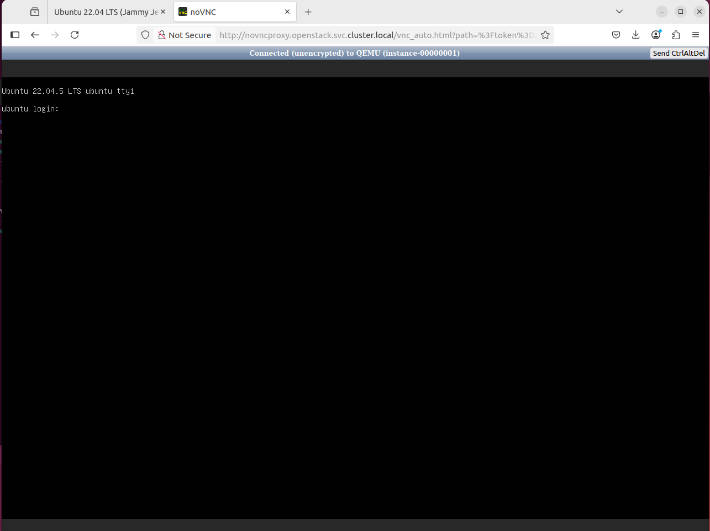

#### PCI Passthrough 확인, 네트워크 확인  

📗 GPU Passthrough

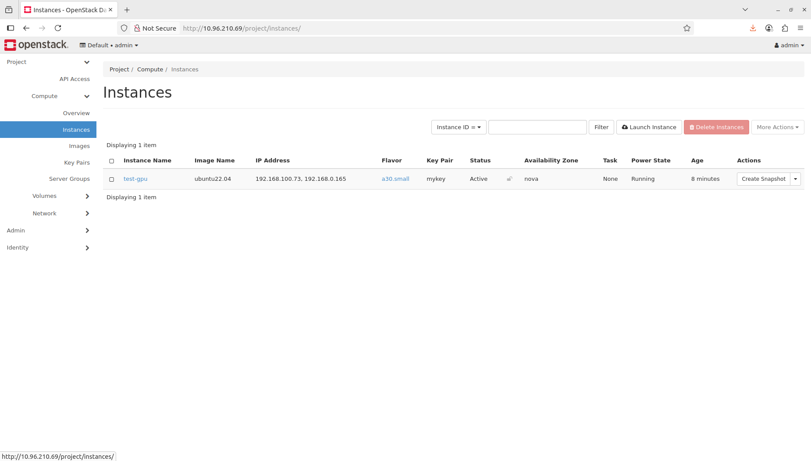  
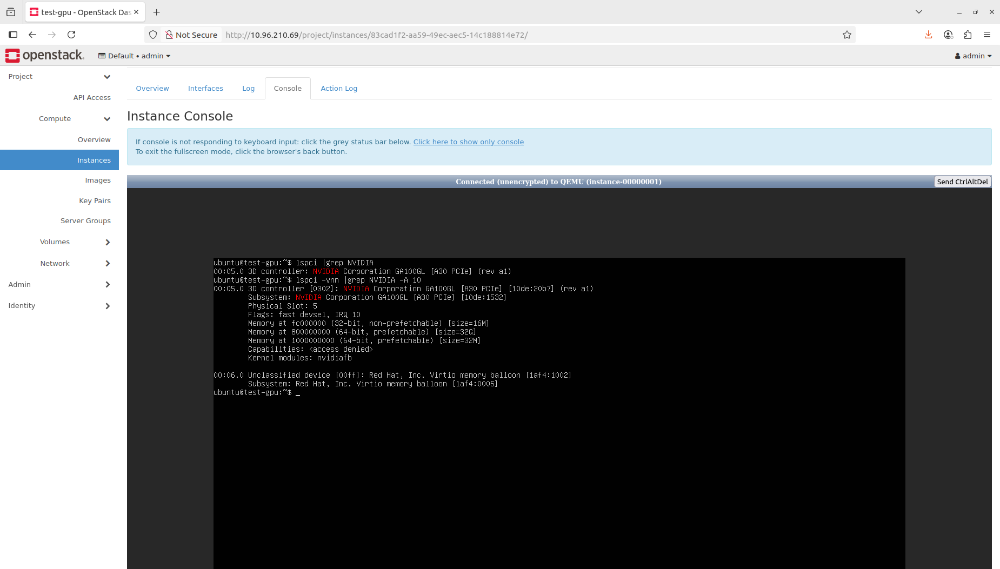  

📗 NPU Passthrough

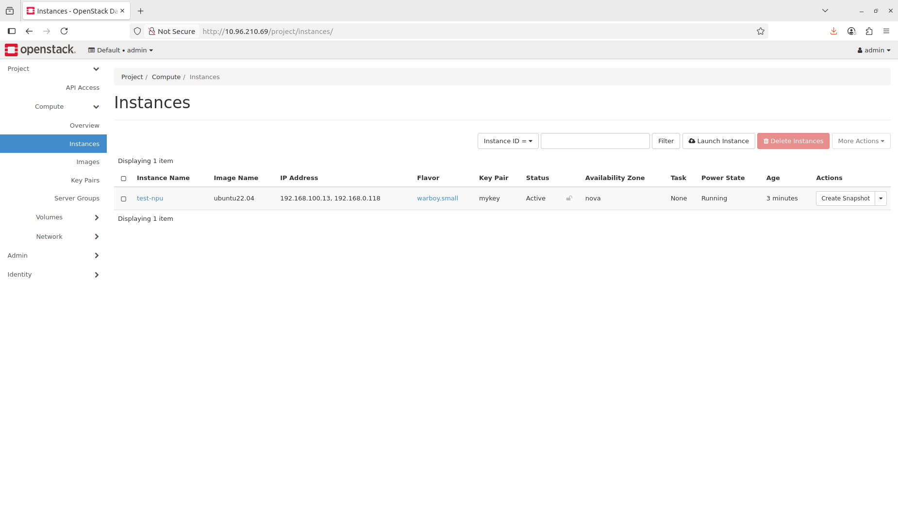  
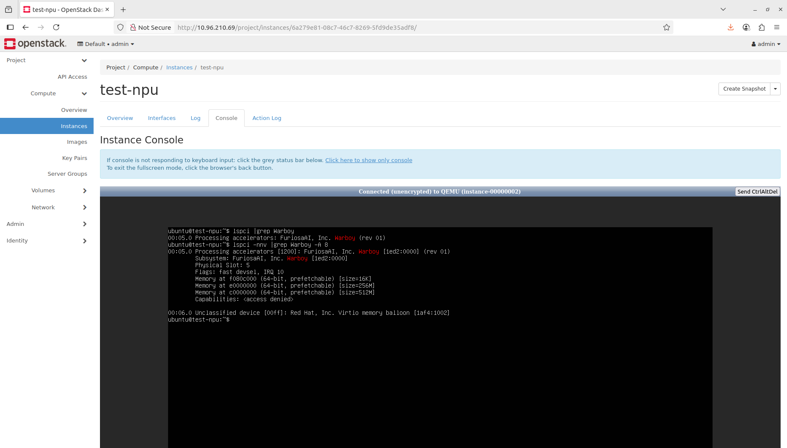  


📕 참고 (VM에 직접 접근하지 않고, 장치 할당 확인 방법)

```shell
kcloud@kcloud-64:~/osh$ kubectl get pod -n openstack -o wide |grep libvirt
libvirt-libvirt-default-22wv9                          1/1     Running     0              3d18h   129.254.202.241   kcloud-241   <none>           <none>
libvirt-libvirt-default-z6m4f                          1/1     Running     0              3d18h   129.254.202.242   kcloud-242   <none>           <none>

kcloud@kcloud-64:~/osh$ kubectl exec -it -n openstack libvirt-libvirt-default-z6m4f -- /bin/bash
Defaulted container "libvirt" out of: libvirt, init (init), init-dynamic-options (init), ceph-admin-keyring-placement (init), ceph-keyring-placement (init)

root@kcloud-242:/# virsh list --all
 Id   Name                State
-----------------------------------
 2    instance-00000002   running

root@kcloud-242:/# virsh dumpxml instance-00000002 |grep \<hostdev -A 7
    <hostdev mode='subsystem' type='pci' managed='yes'>
      <driver name='vfio'/>
      <source>
        <address domain='0x0000' bus='0xaf' slot='0x00' function='0x0'/>
      </source>
      <alias name='hostdev0'/>
      <address type='pci' domain='0x0000' bus='0x00' slot='0x05' function='0x0'/>
    </hostdev>
```

- `<hostdev>` 태그는 PCI Passthrough 장치를 할당했다는 의미  
    - type='pci', driver name='vfio' → VFIO를 통해 직접 PCI 장치를 VM에 연결
    - 이 장치의 PCI 버스 주소가 호스트의 장치(NVIDIA A30, Warboy)과 일치한다면 이 VM에 장치가 Passthrough 할당된 것


📗 일반 VM 두 개 생성 후, 네트워크 형상 확인  

- 두 VM 간 Ping 테스트

  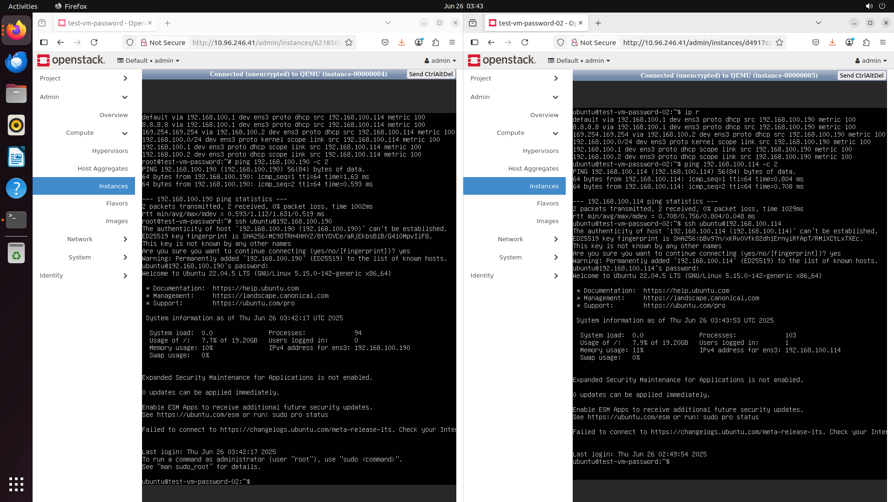  

- 네트워크 토폴로지   

  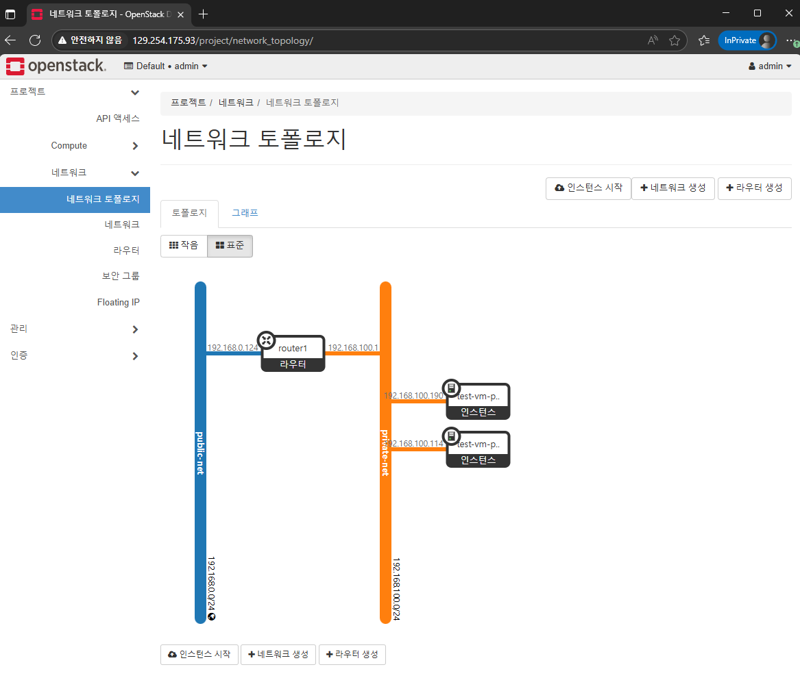  
  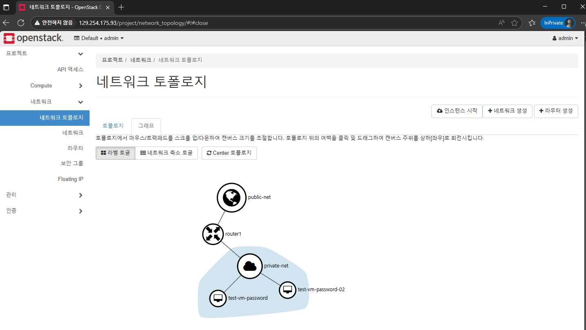  

- 네트워크 테스트 포드(Pod) 생성

```shell
mkdir ~/ubuntu-pod

cat > Dockerfile-ubuntu22.04 << EOF
FROM ubuntu:22.04

ENV DEBIAN_FRONTEND=noninteractive

RUN apt update && \
    apt install -y --no-install-recommends \
      iproute2 \
      net-tools \
      bridge-utils \
      openvswitch-switch \
      dnsutils \
      iputils-ping \
      curl \
      vim \
      traceroute \
      netcat \
      tcpdump \
    && apt clean && rm -rf /var/lib/apt/lists/*

CMD ["/bin/bash"]
EOF

docker build -t cisdocker/ubuntu-net-tools:2204 -f Dockerfile-ubuntu22.04 .
docker login
# cisdocker / #cisbuildenv
docker push cisdocker/ubuntu-net-tools:2204

cat > ubuntu-test.yaml << EOF
apiVersion: v1
kind: Pod
metadata:
  name: ubuntu-test1
  namespace: openstack
spec:
  containers:
  - name: ubuntu
    image: cisdocker/ubuntu-net-tools:2204
    imagePullPolicy: Always
    command: ["/bin/bash", "-c", "--"]
    args: ["while true; do sleep 3600; done"]
    tty: true
    stdin: true
---
apiVersion: v1
kind: Pod
metadata:
  name: ubuntu-test2
  namespace: openstack
spec:
  containers:
  - name: ubuntu
    image: cisdocker/ubuntu-net-tools:2204
    imagePullPolicy: Always
    command: ["/bin/bash", "-c", "--"]
    args: ["while true; do sleep 3600; done"]
    tty: true
    stdin: true
EOF

kubectl apply -f ubuntu-test.yaml
kubectl exec -it ubuntu-test1 -n openstack -- /bin/bash
kubectl exec -it ubuntu-test2 -n openstack -- /bin/bash
```  

```shell
##-- 실행 결과 예, 두 개의 Pod Ping test >
kcloud@kcloud-64:~$ kubectl get pod -A -o wide |grep ubuntu
openstack          ubuntu-test1                                           1/1     Running     0               9m17s   10.244.103.7     kcloud-94   <none>           <none>
openstack        ubuntu-test2                                           1/1     Running     0               9m17s   10.244.0.215     kcloud-93   <none>           <none>

##-- Pod 1 >
kcloud@kcloud-64:~$ kubectl exec -it ubuntu-test1 -n openstack -- /bin/bash

root@ubuntu-test1:/# ip address show
1: lo: <LOOPBACK,UP,LOWER_UP> mtu 65536 qdisc noqueue state UNKNOWN group default qlen 1000
    link/loopback 00:00:00:00:00:00 brd 00:00:00:00:00:00
    inet 127.0.0.1/8 scope host lo
       valid_lft forever preferred_lft forever
    inet6 ::1/128 scope host
       valid_lft forever preferred_lft forever
2: tunl0@NONE: <NOARP> mtu 1480 qdisc noop state DOWN group default qlen 1000
    link/ipip 0.0.0.0 brd 0.0.0.0
3: eth0@if97: <BROADCAST,MULTICAST,UP,LOWER_UP> mtu 1480 qdisc noqueue state UP group default qlen 1000
    link/ether ce:c5:0f:c0:13:8c brd ff:ff:ff:ff:ff:ff link-netnsid 0
    inet 10.244.103.7/32 scope global eth0
       valid_lft forever preferred_lft forever
    inet6 fe80::ccc5:fff:fec0:138c/64 scope link
       valid_lft forever preferred_lft forever

root@ubuntu-test1:/# ping 1.1.1.1 -c 2
PING 1.1.1.1 (1.1.1.1) 56(84) bytes of data.
64 bytes from 1.1.1.1: icmp_seq=1 ttl=61 time=0.330 ms
64 bytes from 1.1.1.1: icmp_seq=2 ttl=61 time=0.281 ms

--- 1.1.1.1 ping statistics ---
2 packets transmitted, 2 received, 0% packet loss, time 1001ms
rtt min/avg/max/mdev = 0.281/0.305/0.330/0.024 ms

root@ubuntu-test1:/# apt update
Hit:1 http://security.ubuntu.com/ubuntu jammy-security InRelease
Hit:2 http://archive.ubuntu.com/ubuntu jammy InRelease
Hit:3 http://archive.ubuntu.com/ubuntu jammy-updates InRelease
Hit:4 http://archive.ubuntu.com/ubuntu jammy-backports InRelease
Reading package lists... Done
Building dependency tree... Done
Reading state information... Done
6 packages can be upgraded. Run 'apt list --upgradable' to see them.

##-- Pod 2 >
kcloud@kcloud-64:~$ kubectl exec -it ubuntu-test2 -n openstack -- /bin/bash

root@ubuntu-test2:/# ip address show
1: lo: <LOOPBACK,UP,LOWER_UP> mtu 65536 qdisc noqueue state UNKNOWN group default qlen 1000
    link/loopback 00:00:00:00:00:00 brd 00:00:00:00:00:00
    inet 127.0.0.1/8 scope host lo
       valid_lft forever preferred_lft forever
    inet6 ::1/128 scope host
       valid_lft forever preferred_lft forever
2: tunl0@NONE: <NOARP> mtu 1480 qdisc noop state DOWN group default qlen 1000
    link/ipip 0.0.0.0 brd 0.0.0.0
3: eth0@if93: <BROADCAST,MULTICAST,UP,LOWER_UP> mtu 1480 qdisc noqueue state UP group default qlen 1000
    link/ether c6:d1:7e:77:8f:38 brd ff:ff:ff:ff:ff:ff link-netnsid 0
    inet 10.244.0.215/32 scope global eth0
       valid_lft forever preferred_lft forever
    inet6 fe80::c4d1:7eff:fe77:8f38/64 scope link
       valid_lft forever preferred_lft forever

root@ubuntu-test2:/# ping 1.1.1.1 -c 2
PING 1.1.1.1 (1.1.1.1) 56(84) bytes of data.
64 bytes from 1.1.1.1: icmp_seq=2 ttl=61 time=0.219 ms

--- 1.1.1.1 ping statistics ---
2 packets transmitted, 1 received, 50% packet loss, time 1021ms
rtt min/avg/max/mdev = 0.219/0.219/0.219/0.000 ms

root@ubuntu-test2:/# apt update
Hit:1 http://security.ubuntu.com/ubuntu jammy-security InRelease
Hit:2 http://archive.ubuntu.com/ubuntu jammy InRelease
Hit:3 http://archive.ubuntu.com/ubuntu jammy-updates InRelease
Hit:4 http://archive.ubuntu.com/ubuntu jammy-backports InRelease
Reading package lists... Done
Building dependency tree... Done
Reading state information... Done
6 packages can be upgraded. Run 'apt list --upgradable' to see them.

root@ubuntu-test2:/# ping 10.244.103.7 -c 2
PING 10.244.103.7 (10.244.103.7) 56(84) bytes of data.
64 bytes from 10.244.103.7: icmp_seq=1 ttl=62 time=0.537 ms
64 bytes from 10.244.103.7: icmp_seq=2 ttl=62 time=0.353 ms

--- 10.244.103.7 ping statistics ---
2 packets transmitted, 2 received, 0% packet loss, time 1031ms
rtt min/avg/max/mdev = 0.353/0.445/0.537/0.092 ms
```  

네트워크 브릿지 확인

```shell
kcloud@kcloud-64:~$ kubectl exec -n openstack -it openvswitch-qb9rt -c openvswitch-vswitchd -- /bin/bash


root@kcloud-94:/# ovs-vsctl show
e7510686-5fd9-4db1-9ba7-1df519715445
    Manager "ptcp:6640:127.0.0.1"
        is_connected: true
    Bridge br-int
        Controller "tcp:127.0.0.1:6633"
            is_connected: true
        fail_mode: secure
        datapath_type: system
        Port qvo3a6ba134-96
            tag: 1
            Interface qvo3a6ba134-96
        Port int-br-ex
            Interface int-br-ex
                type: patch
                options: {peer=phy-br-ex}
        Port qvofb88a1f8-ed
            tag: 1
            Interface qvofb88a1f8-ed
        Port tap70317abf-88
            tag: 1
            Interface tap70317abf-88
                type: internal
        Port qg-74999a65-90
            tag: 2
            Interface qg-74999a65-90
                type: internal
        Port patch-tun
            Interface patch-tun
                type: patch
                options: {peer=patch-int}
        Port br-int
            Interface br-int
                type: internal
        Port qr-8aeb12d0-07
            tag: 1
            Interface qr-8aeb12d0-07
                type: internal
    Bridge br-tun
        Controller "tcp:127.0.0.1:6633"
            is_connected: true
        fail_mode: secure
        datapath_type: system
        Port patch-int
            Interface patch-int
                type: patch
                options: {peer=patch-tun}
        Port br-tun
            Interface br-tun
                type: internal
    Bridge br-ex
        Controller "tcp:127.0.0.1:6633"
            is_connected: true
        fail_mode: secure
        datapath_type: system
        Port enp87s0
            Interface enp87s0
        Port phy-br-ex
            Interface phy-br-ex
                type: patch
                options: {peer=int-br-ex}
        Port br-ex
            Interface br-ex
                type: internal


root@kcloud-94:/# ovs-ofctl show br-int
OFPT_FEATURES_REPLY (xid=0x2): dpid:000086310708bb47
n_tables:254, n_buffers:0
capabilities: FLOW_STATS TABLE_STATS PORT_STATS QUEUE_STATS ARP_MATCH_IP
actions: output enqueue set_vlan_vid set_vlan_pcp strip_vlan mod_dl_src mod_dl_dst mod_nw_src mod_nw_dst mod_nw_tos mod_tp_src mod_tp_dst
 1(int-br-ex): addr:6e:3d:35:8e:e2:dd
     config:     0
     state:      0
     speed: 0 Mbps now, 0 Mbps max
 2(patch-tun): addr:22:35:b4:c8:28:57
     config:     0
     state:      0
     speed: 0 Mbps now, 0 Mbps max
 3(tap70317abf-88): addr:fa:16:3e:99:27:df
     config:     0
     state:      0
     speed: 0 Mbps now, 0 Mbps max
 4(qg-74999a65-90): addr:fa:16:3e:d1:83:32
     config:     0
     state:      0
     speed: 0 Mbps now, 0 Mbps max
 5(qr-8aeb12d0-07): addr:fa:16:3e:c5:8c:d4
     config:     0
     state:      0
     speed: 0 Mbps now, 0 Mbps max
 8(qvo3a6ba134-96): addr:96:3d:a2:f9:3c:c5
     config:     0
     state:      0
     current:    10GB-FD COPPER
     speed: 10000 Mbps now, 0 Mbps max
 9(qvofb88a1f8-ed): addr:9e:d8:bd:d8:79:fb
     config:     0
     state:      0
     current:    10GB-FD COPPER
     speed: 10000 Mbps now, 0 Mbps max
 LOCAL(br-int): addr:86:31:07:08:bb:47
     config:     PORT_DOWN
     state:      LINK_DOWN
     speed: 0 Mbps now, 0 Mbps max
OFPT_GET_CONFIG_REPLY (xid=0x4): frags=normal miss_send_len=0
```

Libvirt 확인

```shell
kcloud@kcloud-64:~$ kubectl exec -n openstack -it libvirt-libvirt-default-zns4n -- /bin/bash
Defaulted container "libvirt" out of: libvirt, init (init), init-dynamic-options (init), ceph-admin-keyring-placement (init), ceph-keyring-placement (init)

root@kcloud-94:/# virsh list --all
 Id   Name                State
-----------------------------------
 3    instance-00000004   running
 4    instance-00000005   running

root@kcloud-94:/# virsh domiflist instance-00000004
 Interface        Type     Source           Model    MAC
------------------------------------------------------------------------
 tap3a6ba134-96   bridge   qbr3a6ba134-96   virtio   fa:16:3e:52:da:9f

root@kcloud-94:/# virsh domiflist instance-00000005
 Interface        Type     Source           Model    MAC
------------------------------------------------------------------------
 tapfb88a1f8-ed   bridge   qbrfb88a1f8-ed   virtio   fa:16:3e:22:f8:49
```